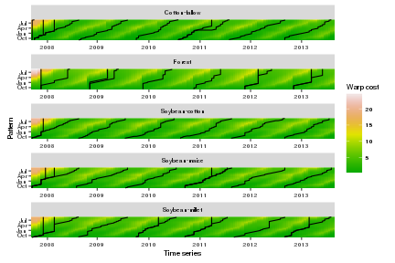
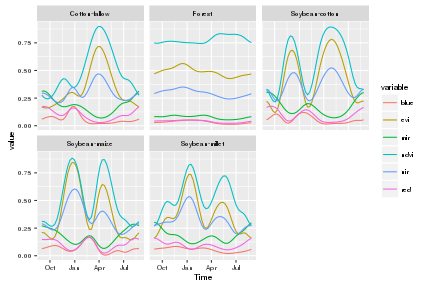
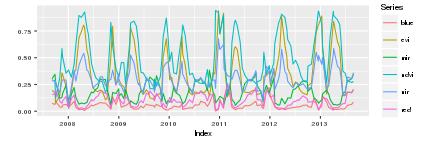
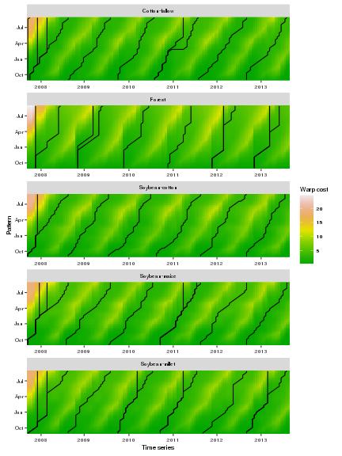

<!-- 
# Build the README.md file for github webpage 
library(knitr)
knit(input="README.Rmd", output = "README.md")
-->


dtwSat
=====

### Time-Weighted Dynamic Time Warping for remote sensing time series analysis
dtwSat provides an implementation of Time-Weighted Dynamic Time Warping (TWDTW) method for satellite image time series analysis and land use classification. It is useful to account for natural and cultivated vegetation types even with inter-annual climatic and seasonal variability. Methods based on dynamic time warping are flexible to handle with irregular sampling and out of phase time series, and have achieved significant results in time series data mining. The [tutorial bellow][Land use classification using dtwSat] shows how to use the package for land use mapping using satellite image time series.

### Install

```r
devtools::install_github("vwmaus/dtwSat")
```

### Quick demo

This dome performs a TWDTW analysis and show the results.

```r
library(dtwSat, quietly = TRUE)
weight.fun = logisticWeight(alpha=-0.1, beta=100, theta=0.5)

alig = twdtw(x=waveletSmoothing(template), 
             patterns=patterns.list, weight.fun = weight.fun, 
             span=180, keep=TRUE) 

class("twdtw")
print(alig)
summary(alig)
```


```r
library(ggplot2)
gp = plot(alig) + theme(text = element_text(size = 8, family="Helvetica"))
gp
```




Land use classification using dtwSat
=====


<!-- 
 Comment 
-->

The [dtwSat](https://cran.r-project.org/web/packages/dtwSat/index.html) package provides an implementation of Time-Weighted Dynamic Time Warping for multi-band satellite image time series analysis. [dtwSat](https://cran.r-project.org/web/packages/dtwSat/index.html) also includes methods for analysis and visualization of results. In this vignette we show how to use the package for land use and land cover classification using satellite image time series and provide some examples of the visualization methods. We use a small area of tropical forest (in Mato Grosso, Brazil) to build typical temporal patterns for different land class and to perform a land use analysis. The implementation in this package is suitable to classify different vegetation types (crops or natural), and it can be extended for different regions of the world.

## Introduction

The Time-Weighted Dynamic Time Warping (TWDTW) is adapted to multi-band satellite image time series analysis, and it is flexible to compare satellite time series even if they are irregularly sampled, or are out of phase in the time axis (cf. Maus et al. [-@Maus:2015] for details).

...

In the sections that follow we present the [input data][Input data] for the algorithm and show, step-by-step, how to perform the TWDTW analysis for satellite image time series. We start by [extracting the time series from the satellite images][Extract time series], and then we [build the typical temporal patterns][Create temporal patterns] for each land class. In order illustrate the TWDTW algorith we first [perform a single time series analysis][Single time series analysis] using the typical temporal patterns, which is followed by an [accuracy assessment][Accuracy assessment], and finally by the [land use mapping application][Land use mapping]. 

## Data 

Our data are a sequence of satellite images ordered over time and a set of ground truth samples. The case study is in a tropical forest area, in Mato Grosso, Brazil, and the time domain ranges from 2007 to 2013. We also use a set of ground truth samples of the following land classes: forest, cotton-fallow, soybean-cotton, soybean-maize, and soybean-millet.

For the TWDTW analysis we use the MODIS product [MOD13Q1](https://lpdaac.usgs.gov/dataset_discovery/modis/modis_products_table/mod13q1). This produt has 250 m spatial and 16 day temporal resolution, which, for our case study, means a sequence of 160 images with 999 pixels each. 

The installation of **dtwSat** provides the a time ordered sequence of *tif* with 7 bands (ndvi, evi, red, nir, mir, blue, and doy) extracted from the MODIS product MOD13Q1. The *tif* files and the ground truth data are in the folder *lucc_MT* installed with **dtwSat**.

## Build inputs 

[dtwSat](https://cran.r-project.org/web/packages/dtwSat/index.html) has interface to [raster](https://cran.r-project.org/web/packages/raster/index.html) and [sp](https://cran.r-project.org/web/packages/sp/index.html) packages. This way one can easily apply the TWDTW analysis for different areas using his/her own set of field samples. The algorithm runs over multiple satellite bands stored as a `list` of raster objects (`RasterBrick` or `RasterStack`), i.e. each node in the list has one band whose layers are an ordered sequence of satellite measurments over time. All raster objects in the list must have the same temporal and spatial extension. 

To build the raster time series lets first locate the *tif* files in the folder *lucc_MT* (installed with **dtwSat** package). These files are ordered by time, and therefore we can build a list ofiles using the folowing commands:

```r
library(dtwSat)
raster_dir = system.file('lucc_MT',  package = 'dtwSat')
raster_files_list = paste(raster_dir, dir(raster_dir, pattern = '.tif'), sep = '/')
```

Using the function `raster::stack` we create a `list` of multi layer `raster::RasterStack` objects (raster time series) for each band: ndvi, evi, red, nir, mir, such that

```r
library(raster)
bands = 1:6
names(bands) = c('ndvi','evi','red','nir','mir','blue')
stack_list = lapply(bands, function(x) 
          stack(raster_files_list, bands = x)
  )
```

and, optionaly we can also build a `raster::RasterStack` of the real day of the year (doy) for each pixels 

```r
doy = stack(raster_files_list, bands = 7)
```

At this point we have a list of multi layer raster objects, however without the time reference. Therefore, the package **dtwSat** also provides the time line of the *tif* files `timeline.csv` in the folder *lucc_MT*. The time information is also part of the name in the *tif* files, such as it usually comes from the data provider.

```r
timeline = read.table(system.file('lucc_MT/timeline.csv', package = 'dtwSat'), as.is = TRUE)
```

The `timeline` and `RasterStack` objects are passed to `createRasterTimeSeries` that will retrieve a list of raster time series, which is the input for other functions of **dtwSat** package. The access of time series from several *tif* files might become slow. Therefore, the function `createRasterTimeSeries` also provides an interface to `raster::writeRaster` and creates independet files for each time series, i.e. each file will have the time series for one band allowing us to use `RasterBrick` instead of `RasterStack` objects, which can have an speedup of ~70 in our small example. Here we use `RasterStack`, such that 

```r
raster_list = createRasterTimeSeries(x = stack_list, timeline = timeline[,1], doy = doy)
```


Before we create the typical temporal patterns for each land class we will first load the ground truth dataset (*lucc_MT/samples_MT.shp*), which has location, temporal information (i.e. the period `from`, `to`), and land class of our ground truth samples. 

```r
library(rgdal)
field_samples = readOGR(system.file('lucc_MT/samples_MT.shp', package="dtwSat"),
                        layer = "samples_MT")
```

```r
names(field_samples)
```

```
[1] "from"  "to"    "group"
```

```r
table(field_samples$group)
```

```

 Cotton-fallow         Forest Soybean-cotton  Soybean-maize Soybean-millet 
            68            138             79            134            184 
```


## Extract time series and create temporal patterns
TWDTW uses typical temporal patterns for each land classes (well known temporal patterns) to classify segments of a long-term time series (unknown time series). Therefore, a part of the field samples are used to derive the temporal patterns for each class.

Once we have built our all the inputs, we can extract the time series for each spatial location and period (`from`, `to`) that will be used to build the typical temporal patterns for each land class. The extraction process might take some minutes because it has to access several files to get the time series (here using 4 cores ~2 minutes).

```r
ts_list = extractTimeSeries(x = raster_list, y = field_samples, mc.cores = 4)
```

In the example bellow we use all time series extracted in the previous step to create typical temporal patterns for each class. The function `createPattern` uses a Generalised Additive Model (GAM) (cf. [mgcv](https://cran.r-project.org/web/packages/mgcv/index.html)) to create the temporal patterns. The minimum arguments for that are the start (`from`), the end (`to`), and the frequency in days of the output temporal patterns, besides the fitting formula to be passed to `mgcv::gam`, e.g. a gaussian with cyclic cubic spline, such that `y ~ s(time, bs="cc")`. Note that the independent variable must be always `time`.

```r
groups = as.character(unique(field_samples$group))
names(groups) = groups
field_samples_list = lapply(groups, function(x) ts_list[field_samples$group==x])
patterns_list = lapply(field_samples_list, createPattern, 
                       from = "2004-09-01", to = "2005-09-01", 
                       freq = 8, formula = y ~ s(x, bs = "cc"))
```

Below we plot the resulting temporal patterns for each class. 


```r
library(ggplot2)
plotPatterns(patterns_list) + theme(text = element_text(size = 8, family="Helvetica"))
```



## Single time series analysis

In this section we use the typical temporal patterns to classify a single time series and to show some of the analysis and visualization methods. Firs, lest extract the time series from our raster object

```r
proj4string = CRS("+proj=longlat +datum=WGS84 +no_defs")
longitude = -55.9653
latitude = -12.0406
from = "2007-09-01"
to = "2013-09-01"

point_sp = SpatialPoints(data.frame(longitude, latitude), proj4string)
point_sp = SpatialPointsDataFrame(point_sp, data = data.frame(from, to))
template = extractTimeSeries(x = raster_list, y = point_sp)
```


```r
autoplot(template[[1]], facet=NULL) + theme(text = element_text(size = 8, family="Helvetica")) 
```




The function `twdtw` performs a multidimensional TWDTW analysis and get the alignments between the temporal patterns and a template time series. Optionally, By default it has time weight equal to zero, which means that the algorithm runs the original version od DTW [@Muller:2007]. However, here define a logistic time weight function [@Maus:2015], such that

```r
weight.fun = logisticWeight(alpha=-0.1, beta=100, theta=0.5)
alig = twdtw(x=template[[1]], patterns=patterns_list, weight.fun = weight.fun, 
             keep=TRUE)
```
The function retrieves an object of class `twdtw` with all possible alignments of all temporal patterns to the template. A set of methods are available for the class `twdtw`, e.g. `plot`, `summary`, `getPatternNames`, `getAlignments`, `getMatches`, and `getInternals`. 

```r
class(alig)
```

```
[1] "twdtw"
attr(,"package")
[1] "dtwSat"
```

```r
alig
```

```
Time-Weighted DTW alignment object
Number of alignments: 48 
        pattern       from         to distance
1 Cotton-fallow 2011-08-11 2012-08-29 2.126412
2 Cotton-fallow 2007-09-26 2008-08-18 2.440281
3 Cotton-fallow 2008-08-18 2009-08-05 2.655514
4 Cotton-fallow 2009-10-01 2010-08-08 3.053718
5 Cotton-fallow 2010-08-08 2011-08-11 3.690460
6 Cotton-fallow 2012-08-29 2013-08-16 3.832881
```

```r
summary(alig)
```

```
               N.Alig  Min. X1st.Qu. Median  Mean X3rd.Qu.  Max.
Cotton-fallow      10 2.126    2.755  3.762 6.964    9.925 17.62
Forest             10 4.468    4.932  5.785 7.366    8.807 16.10
Soybean-cotton      7 2.665    2.842  3.065 5.024    3.499 16.76
Soybean-maize      10 2.543    2.645  3.891 6.004    7.619 16.23
Soybean-millet     11 2.971    3.627  4.607 6.583    8.428 14.88
```


```r
plot(alig) + theme(text = element_text(size = 8, family="Helvetica"))
```



... Other plot methods ...

... `classifyIntervals` ....


## Land use mapping


## Accuracy assessment

We split the set of samples to create the typical temporal patterns (10%) and to assess the results (90%), and run 100 simulation choosing random samples.


## References


