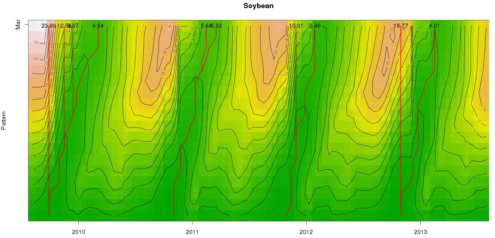

dtwSat
=====

Time-Weighted Dynamic Time Warping (TWDTW) for satellite image time series analysis

dtwSat extends the dtw R package for multidimensional satellite image time series analysis. 

<h3>To use the package:</h3>
<ol>
	<li>Open R</li>
	<li>Install devtools <code>install.packages("devtools")</code></li>
	<li>Load devtools <code>library(devtools)</code></li>
	<li>Install the dtwSat package <code>install_github("vwmaus/dtwSat")</code></li>
</ol>

<h3>Usage examples:</h3>
<ol>
	<li>Load the dtwSat package: <code>library(dtwSat)</code></li>
	<li>Class names: <code>names(query.list)</code></li>
	<li>Run twdtw alignment for the query 1: <code>alig = twdtw(query.list[["Soybean"]], template, weight = "logistic", alpha = 0.1, beta = 50)</code></li>
	<li>Print twdtw object: <code>print(alig)</code></li>
	<li>Plot twdtw object: <code>plot(alig)</code></li>
</ol>

<h3>To build the package:</h3>
<ol>
	<li>Clone the project: <code>git clone https//github.com/vwmaus/dtwSat.git</code>.</li>
	<li>Open Rstudio, go to File - Open Project and pick the file <code>dtwSat.Rproj</code>.</li>
	<li>Install the required packages <code>install.packages(c("roxygen2", "testthat"))</code>.</li>
	<li>Go to the <i>Build</i> tab in the upper-right panel and press the button <i>Build & Reload</i>. After this the package is ready to use.</li>
	<li>You can also create a source package: Go to the <i>Build</i> tab, display the menu <i>More</i> and select the option <i>Build Source Package</i>.</li>
</ol> 
