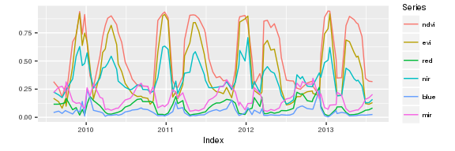
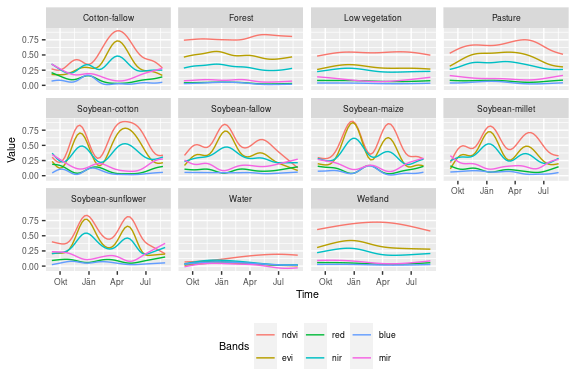
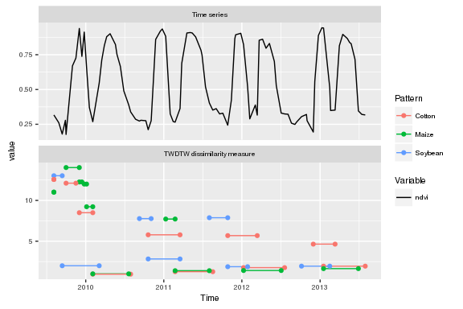
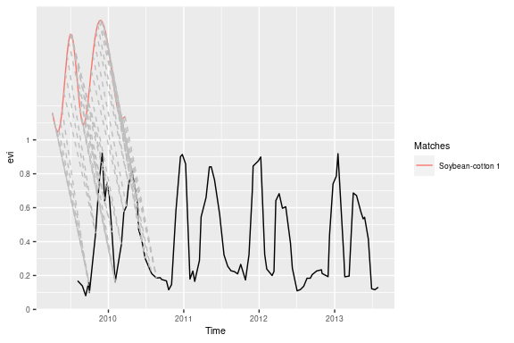
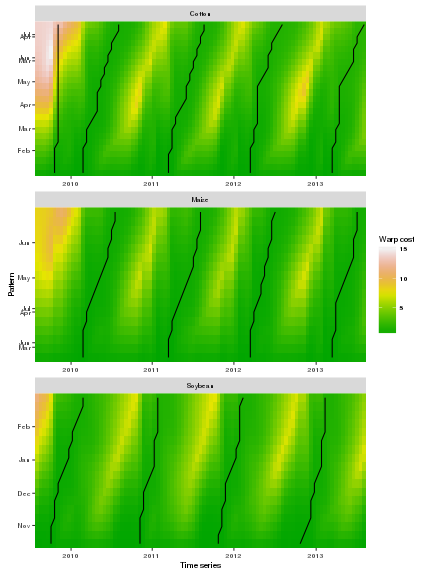
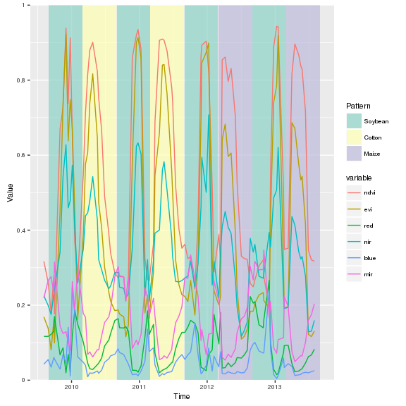
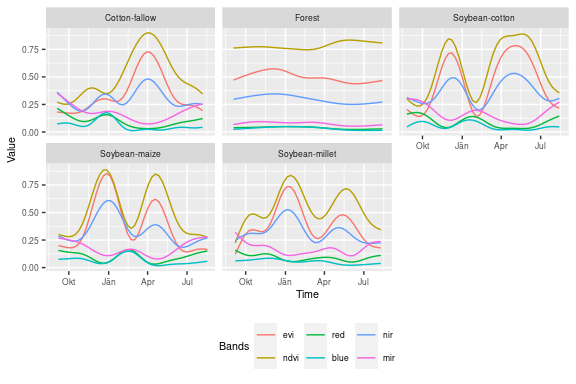
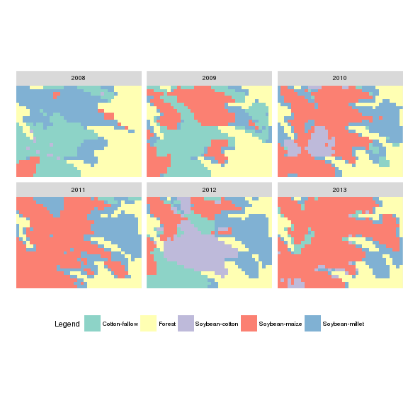
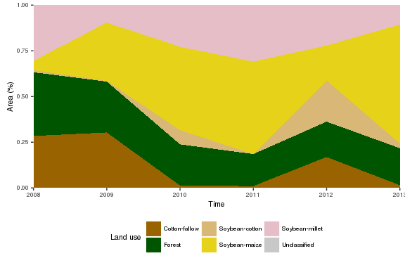
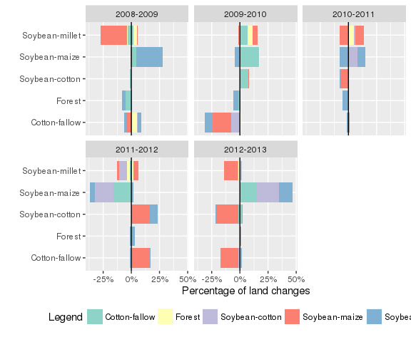

<!--
# Otput to render md file for github webpage 
output_format = rmarkdown::md_document(variant = "markdown_github", preserve_yaml = TRUE)
# Render vignettes
rmarkdown::render(input="./vignettes/jss_draft.Rmd", output_format=output_format)
-->
dtwSat
======

### Time-Weighted Dynamic Time Warping for satellite image time series analysis

The opening of large archives of satellite data such as LANDSAT, MODIS and the SENTINELs has given researchers unprecedented access to data, allowing them to better quantify and understand local and global land change. The need to analyse such large data sets has lead to the development of automated and semi-automated methods for satellite image time series analysis. However, few of the proposed methods for remote sensing time series analysis are available as open source software. The package provides an implementation of the Time-Weighted Dynamic Time Warping (TWDTW) method for land use and land cover mapping using sequence of multi-band satellite images (Maus et al. 2016). Methods based on dynamic time warping are flexible to handle irregular sampling and out-of-phase time series, and they have achieved significant results in time series analysis (Velichko and Zagoruyko 1970; Hiroaki Sakoe and Chiba 1971; H. Sakoe and Chiba 1978; Rabiner and Juang 1993; Berndt and Clifford 1994; Keogh and Ratanamahatana 2005; Müller 2007). is available from the Comprehensive R Archive Network (CRAN) and contributes to making methods for satellite time series analysis available to a larger audience. The package supports the full cycle of land cover classification using image time series, ranging from selecting temporal patterns to visualising and evaluating the results. Bellow we show a quick demo of the package and some [vignettes](#vignettes).

### Install

``` r
devtools::install_github("vwmaus/dtwSat")
```

### Quick demo

In this quick dome we will perform a TWDTW analysis for a single time series. The data for the analysis are a set of temporal patterns in `patterns.list` and an example of time series in `example_ts`. These time series are in `zoo` format and come with the package installation. Suppose that we want to know the crop type of each subinterval in following time series:

``` r
library(dtwSat)
# Create and plot object time series 
ts = twdtwTimeSeries(example_ts) 
class(ts)
plot(ts, type="timeseries") 
```


<p class="caption">
Fig. 1. example\_ts time series.
</p>

We know that in the region where the time series was observed we have *soybean*, *cotton*, and *maize*, whose typical temporal pattern are:

``` r
# Create and plot object time series 
patt = twdtwTimeSeries(patterns.list)
class(patt)
plot(patt, type="patterns") 
```


<p class="caption">
Fig. 2. Typical temporal patterns of *soybean*, *cotton*, and *maize*.
</p>

Using the these temporal patterns we run the TWDTW analysis, such that

``` r
log_fun = logisticWeight(alpha=-0.1, beta=100) # Logistic time-weight
matches = twdtwApply(x=ts, y=patt, weight.fun=log_fun, keep=TRUE) 
```

The result is a `twdtwMatches` object with all possible matches of the patterns to the time series

``` r
class(matches)
show(matches)
```

We can use several plot methods to visualize the results of the analysis in the `twdtwMatches` object, for example, to plot the alignments

``` r
plot(x = matches, type = "alignments")
```


<p class="caption">
Fig. 3. TWDTW alignments over time and cost (distance) in y-axis.
</p>

to plot matching point

``` r
plot(x = matches, type = "matches", attr = "evi", patterns.labels="Soybean", k=4) 
```


<p class="caption">
Fig. 4. The best match for each crop type.
</p>

to plot minimum cost paths

``` r
plot(x = matches, type = "paths", k = 1:4) 
```


<p class="caption">
Fig. 5. The minimum cost path of the TWDTW alignment for each crop type.
</p>

and, finally to classify the subintervals of the time series

``` r
plot(x = matches, type = "classification",
     from = "2009-09-01", to = "2013-09-01", 
     by = "6 month", overlap = 0.5) 
```


<p class="caption">
Fig. 6. Classification using the best match for each subinterval.
</p>

### Raster time series classification

Load raster time series:

``` r
evi = brick(system.file("lucc_MT/data/evi.tif", package="dtwSat"))
ndvi = brick(system.file("lucc_MT/data/ndvi.tif", package="dtwSat"))
red = brick(system.file("lucc_MT/data/red.tif", package="dtwSat"))
blue = brick(system.file("lucc_MT/data/blue.tif", package="dtwSat"))
nir = brick(system.file("lucc_MT/data/nir.tif", package="dtwSat"))
mir = brick(system.file("lucc_MT/data/mir.tif", package="dtwSat"))
doy = brick(system.file("lucc_MT/data/doy.tif", package="dtwSat"))
timeline = scan(system.file("lucc_MT/data/timeline", package="dtwSat"), what="date")
```

Build multi-band raster time series:

``` r
rts = twdtwRaster(evi, ndvi, red, blue, nir, mir, timeline = timeline, doy = doy)
```

Load temporal patterns:

``` r
load(system.file("lucc_MT/temporal_patterns.RData", package="dtwSat"))
patt = twdtwTimeSeries(temporal_patterns)
```

``` r
# Create and plot object time series 
load(system.file("lucc_MT/temporal_patterns.RData", package="dtwSat"))
patt = twdtwTimeSeries(temporal_patterns)
plot(patt, type="patterns") 
```


<p class="caption">
Fig. 7. Typical temporal patterns of *Cotton-fallow*, *Forest*, *Soybean-cotton*, *Soybean-maize*, and *Soybean-millet*.
</p>

Apply TWDTW analysis:

``` r
log_fun = weight.fun=logisticWeight(-0.1,50)
r_twdtw = twdtwApply(x=rts, y=patt, weight.fun=log_fun, format="GTiff", overwrite=TRUE)
```

Classify raster time series:

``` r
r_lucc = twdtwClassify(r_twdtw, format="GTiff", overwrite=TRUE)
```

Visualising the results:

Land use maps:

``` r
plot(x = r_lucc, type = "maps")
```


<p class="caption">
Fig. 8. Land use maps based on TWDTW analysis.
</p>

Land use area:

``` r
plot(x = r_lucc, type = "area")
```


<p class="caption">
Fig. 9. Land use area based on TWDTW analysis.
</p>

Land use changes:

``` r
plot(x = r_lucc, type = "changes")
```


<p class="caption">
Fig. 10. Land use changes based on TWDTW analysis.
</p>

To see more example please take a look at [vignettes](#vignettes) and if you want to learn more about the TWDTW method (see, Maus et al. 2016).

### Vignettes

<!--1. [Timw-Weighted Dynamic Time Warping method](./vignettes/twdtw.md)-->
### References

Berndt, Donald J., and James Clifford. 1994. “Using Dynamic Time Warping to Find Patterns in Time Series.” In *KDD Workshop*, edited by Usama M. Fayyad and Ramasamy Uthurusamy, 359–70. AAAI Press.

Keogh, Eamonn, and Chotirat Ann Ratanamahatana. 2005. “Exact Indexing of Dynamic Time Warping.” *Knowledge Information Systems* 7 (3): 358–86.

Maus, Victor, Gilberto Camara, Ricardo Cartaxo, Alber Sanchez, Fernando M. Ramos, and Gilberto R. de Queiroz. 2016. “A Time-Weighted Dynamic Time Warping Method for Land-Use and Land-Cover Mapping.” *Selected Topics in Applied Earth Observations and Remote Sensing, IEEE Journal of* PP (99): 1–11. doi:[10.1109/JSTARS.2016.2517118](http://dx.doi.org/10.1109/JSTARS.2016.2517118).

Müller, Meinard. 2007. *Information Retrieval for Music and Motion*. London: Springer.

Rabiner, Lawrence, and Biing-Hwang Juang. 1993. *Fundamentals of Speech Recognition*. Prentice-Hall International, Inc.

Sakoe, H., and S. Chiba. 1978. “Dynamic Programming Algorithm Optimization for Spoken Word Recognition.” *Acoustics, Speech and Signal Processing, IEEE Transactions on* 26 (1): 43–49. doi:[10.1109/TASSP.1978.1163055](http://dx.doi.org/10.1109/TASSP.1978.1163055).

Sakoe, Hiroaki, and Seibi Chiba. 1971. “A Dynamic Programming Approach to Continuous Speech Recognition.” In *Proceedings of the Seventh International Congress on Acoustics, Budapest*, 3:65–69. Budapest: Akadémiai Kiadó.

Velichko, V.M., and N.G. Zagoruyko. 1970. “Automatic Recognition of 200 Words.” *International Journal of Man-Machine Studies* 2 (3): 223–34. doi:[10.1016/S0020-7373(70)80008-6](http://dx.doi.org/10.1016/S0020-7373(70)80008-6).
