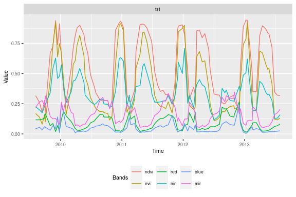
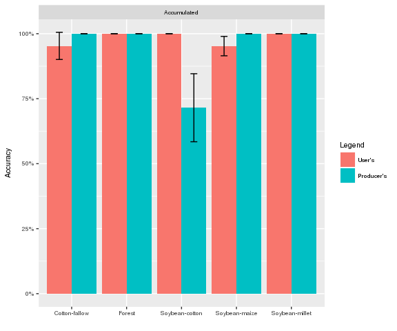
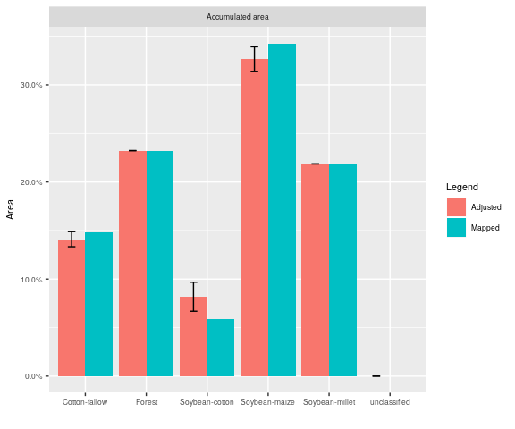

<!-- Set global env -->
<!-- 
    rmarkdown::render("README.Rmd") 
-->
dtwSat
======

[](https://travis-ci.org/vwmaus/dtwSat) [](http://www.gnu.org/licenses/gpl-2.0.html) [](http://cran.r-project.org/package=dtwSat) [](http://www.r-pkg.org/pkg/dtwSat)

### Time-Weighted Dynamic Time Warping for satellite image time series analysis

The opening of large archives of satellite data such as Landsat, MODIS and the Sentinels has given researchers unprecedented access to data, allowing them to better quantify and understand local and global land change. The need to analyse such large data sets has lead to the development of automated and semi-automated methods for satellite image time series analysis. However, few of the proposed methods for remote sensing time series analysis are available as open source software. The package *dtwSat* provides an implementation of the Time-Weighted Dynamic Time Warping (TWDTW) method for land cover mapping using multi-band satellite image time series (Maus et al. 2016). Methods based on dynamic time warping are flexible to handle irregular sampling and out-of-phase time series, and they have achieved significant results in time series analysis (Velichko and Zagoruyko 1970; Hiroaki Sakoe and Chiba 1971; H. Sakoe and Chiba 1978; Rabiner and Juang 1993; Berndt and Clifford 1994; Keogh and Ratanamahatana 2005; Müller 2007). *dtwSat* is also available from the Comprehensive R Archive Network (CRAN). *dtwSat* provides full cycle of land cover classification using image time series, ranging from selecting temporal patterns to visualising, and assessing the results. Bellow we show a quick demo of the package usage.

### Install

The GitHub version requires the package *devtools*

``` r
install.packages("devtools")
devtools::install_github("vwmaus/dtwSat")
```

### Quick demo

In this quick dome we will perform a TWDTW analysis for a single time series. The data for the analysis are a set of temporal patterns in `MOD13Q1.patterns.list` and an example of time series in `MOD13Q1.ts`. These time series are in `zoo` format and come with the package installation. Suppose that we want to know the crop type of each subinterval in following time series:

``` r
library(dtwSat)
# Create and plot object time series 
ts = twdtwTimeSeries(MOD13Q1.ts)
class(ts)
plot(ts, type="timeseries")
```


<p class="caption">
Fig. 1. Example time series which we want to classify.
</p>

We know that in the region where the time series was observed we have *soybean*, *cotton*, and *maize*, whose typical temporal pattern are:

``` r
# Create and plot object time series 
patt = twdtwTimeSeries(MOD13Q1.patterns.list)
class(patt)
plot(patt, type="patterns") 
```


<p class="caption">
Fig. 2. Typical temporal patterns of *soybean*, *cotton*, and *maize*.
</p>

Using these temporal patterns we run the TWDTW analysis, such that

``` r
# Define logistic time-weight, see Maus et al. (2016)
log_fun = logisticWeight(alpha=-0.1, beta=100) 
# Run TWDTW analysis 
matches = twdtwApply(x=ts, y=patt, weight.fun=log_fun, keep=TRUE) 
```

The result is a `twdtwMatches` object with all possible matches of the patterns to the time series

``` r
class(matches)
```

    ## [1] "twdtwMatches"
    ## attr(,"package")
    ## [1] "dtwSat"

``` r
show(matches)
```

    ## An object of class "twdtwMatches"
    ## Number of time series: 1 
    ## Number of Alignments: 16 
    ## Patterns labels: Soybean Cotton Maize

We can use several plot methods to visualize the results of the analysis in the `twdtwMatches` object, for example, to plot the alignments

``` r
plot(x = matches, type = "alignments")
```


<p class="caption">
Fig. 3. TWDTW alignments over time and cost (distance) in y-axis.
</p>

to plot matching point

``` r
plot(x = matches, type = "matches", attr = "evi", patterns.labels="Soybean", k=4) 
```


<p class="caption">
Fig. 4. The four best matches of *soybean*.
</p>

to plot minimum cost paths

``` r
plot(x = matches, type = "paths", k = 1:4) 
```


<p class="caption">
Fig. 5. The minimum cost path of the TWDTW alignment for each crop type.
</p>

and, finally to classify the subintervals of the time series. The plot will select the best match for each period of 6 months, i.e. the class for each period.

``` r
plot(x = matches, type = "classification",
     from = "2009-09-01", to = "2013-09-01", 
     by = "6 month", overlap = 0.5) 
```


<p class="caption">
Fig. 6. Classification using the best match for each subinterval.
</p>

### Raster time series classification

The next example shows how to classify a raster time series, i.e. the same as we did in the quick demo but now for each pixel location. For that we use a set of MODIS EVI (MOD13Q1 product) images from 2007 to 2013 for a region in the Brazilian Amazon. These data is included in the package installation. Load EVI raster time series:

``` r
evi = brick(system.file("lucc_MT/data/evi.tif", package="dtwSat"))
```

Load the dates of the MODIS images:

``` r
timeline = scan(system.file("lucc_MT/data/timeline", package="dtwSat"), what="date")
```

Build raster time series:

``` r
rts = twdtwRaster(evi, timeline = timeline)
```

Load the set of ground truth samples and projection information:

``` r
field_samples = read.csv(system.file("lucc_MT/data/samples.csv", package="dtwSat"))
proj_str = scan(system.file("lucc_MT/data/samples_projection", package="dtwSat"), what = "character")
```

We use the package *caret* to split the samples into training (10%) and validation (90%)

``` r
library(caret)
set.seed(1)
I = unlist(createDataPartition(field_samples$label, p = 0.1))
training_samples   = field_samples[I,]
validation_samples = field_samples[-I,]
```

Extract the EVI time for each sample location

``` r
ts_training_samples = getTimeSeries(rts, y = training_samples, proj4string = proj_str)
```

Create EVI temporal patterns using training samples

``` r
temporal_patterns = createPatterns(ts_training_samples, freq = 8, formula = y ~ s(x))
```

``` r
plot(temporal_patterns, type="patterns") 
```


<p class="caption">
Fig. 7. Typical temporal patterns of *Cotton-fallow*, *Forest*, *Soybean-cotton*, *Soybean-maize*, and *Soybean-millet*.
</p>

Apply TWDTW analysis:

``` r
# Define logistic time-weight, see Maus et al. (2016)
log_fun = logisticWeight(-0.1,50)
# Run TWDTW analysis 
r_twdtw = twdtwApply(x=rts, y=temporal_patterns, weight.fun=log_fun, format="GTiff", overwrite=TRUE)
```

Classify raster raster time series using the results from the TWDTW analysis

``` r
r_lucc = twdtwClassify(r_twdtw, format="GTiff", overwrite=TRUE)
```

Visualising the results.

Land cover maps

``` r
plot(x = r_lucc, type = "maps")
```


<p class="caption">
Fig. 8. Land cover maps based on TWDTW analysis.
</p>

Land cover area for each class over time

``` r
plot(x = r_lucc, type = "area")
```


<p class="caption">
Fig. 9. Land cover area based on TWDTW analysis.
</p>

Land cover changes over time (gains and losses from/to classes)

``` r
plot(x = r_lucc, type = "changes")
```


<p class="caption">
Fig. 10. Land cover changes based on TWDTW analysis.
</p>

We use the validation samples to compute the metrics for accuracy assessment.

``` r
twdtw_assess = twdtwAssess(r_lucc, y = validation_samples, 
                           proj4string = proj_str, conf.int=.95) 
show(twdtw_assess)
```

Visualizing User's and Producer's accuracy

``` r
plot(x = twdtw_assess, type = "accuracy")
```


<p class="caption">
Fig. 11. User's and Producer's accuracy.
</p>

Visualizing area uncertainty

``` r
plot(x = twdtw_assess, type = "area")
```


<p class="caption">
Fig. 12. Area uncertainty.
</p>

For further discussion on the package see the [vignettes](#vignettes) and if you want to learn more about the TWDTW method (see, Maus et al. 2016).

### Vignettes

[dtwSat: Time-Weighted Dynamic Time Warping for Satellite Image Time Series Analysis in R](./inst/doc/applying_twdtw.pdf)

### References

Berndt, Donald J., and James Clifford. 1994. “Using Dynamic Time Warping to Find Patterns in Time Series.” In *KDD Workshop*, edited by Usama M. Fayyad and Ramasamy Uthurusamy, 359–70. AAAI Press.

Keogh, Eamonn, and Chotirat Ann Ratanamahatana. 2005. “Exact Indexing of Dynamic Time Warping.” *Knowledge Information Systems* 7 (3): 358–86.

Maus, Victor, Gilberto Camara, Ricardo Cartaxo, Alber Sanchez, Fernando M. Ramos, and Gilberto R. de Queiroz. 2016. “A Time-Weighted Dynamic Time Warping Method for Land-Use and Land-Cover Mapping.” *IEEE Journal of Selected Topics in Applied Earth Observations and Remote Sensing* 9 (8): 3729–39. doi:[10.1109/JSTARS.2016.2517118](https://doi.org/10.1109/JSTARS.2016.2517118).

Müller, Meinard. 2007. *Information Retrieval for Music and Motion*. London: Springer-Verlag.

Rabiner, Lawrence, and Biing-Hwang Juang. 1993. *Fundamentals of Speech Recognition*. New Jersey: Prentice-Hall International, Inc.

Sakoe, H., and S. Chiba. 1978. “Dynamic Programming Algorithm Optimization for Spoken Word Recognition.” *IEEE Transactions on Acoustics, Speech, and Signal Processing* 26 (1): 43–49. doi:[10.1109/TASSP.1978.1163055](https://doi.org/10.1109/TASSP.1978.1163055).

Sakoe, Hiroaki, and Seibi Chiba. 1971. “A Dynamic Programming Approach to Continuous Speech Recognition.” In *Proceedings of the Seventh International Congress on Acoustics, Budapest*, 3:65–69. Budapest: Akadémiai Kiadó.

Velichko, V.M., and N.G. Zagoruyko. 1970. “Automatic Recognition of 200 Words.” *International Journal of Man-Machine Studies* 2 (3): 223–34. doi:[10.1016/S0020-7373(70)80008-6](https://doi.org/10.1016/S0020-7373(70)80008-6).
