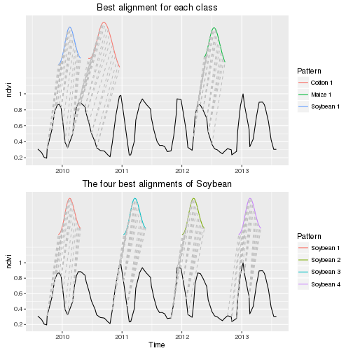
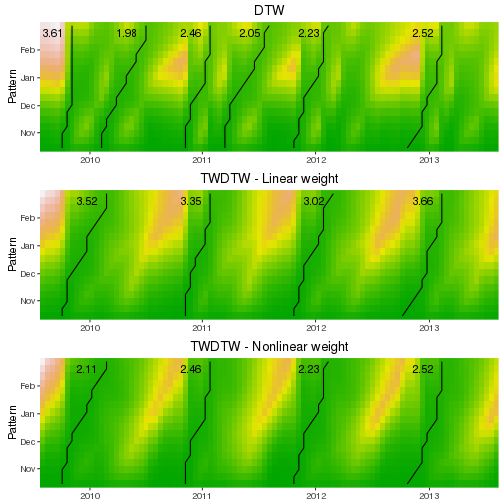

---
output:
  md_document:
    variant: markdown_github
---

<!-- 
# Edit and run 
library(knitr)
knit(input="README.Rmd", output = "README.md")
-->

dtwSat
=====

### Time-Weighted Dynamic Time Warping for remote sensing time series analysis
dtwSat provides a Time-Weighted Dynamic Time Warping (TWDTW) algorithm to measure similarity between two temporal sequences. This adaptation of the classical Dynamic Time Warping (DTW) algorithm is flexible to compare events that have a strong time dependency, such as phenological stages of cropland systems and tropical forests. 

### Install

```r
devtools::install_github("vwmaus/dtwSat")
```


### Quick demo

This dome performs a dtwSat analysis and show the results.

```r
library(dtwSat, quietly = TRUE)
names(patterns.list)
```

```
## [1] "Soybean" "Cotton"  "Maize"
```

```r
weight.fun = logisticWeight(alpha=-0.1, beta=100, theta=0.5)

alig = twdtw(patterns=patterns.list, 
             timeseries=waveletSmoothing(timeseries=template), 
             weight.fun = weight.fun, span=180, keep=TRUE) 

is(alig, "dtwSat")
```

```
## [1] TRUE
```

```r
print(alig)
```

```
## Time-Weighted DTW alignment object
## Number of alignments: 13 
##   pattern       from         to  distance
## 1 Soybean 2009-10-01 2010-03-05 1.0561766
## 2 Soybean 2011-10-27 2012-02-07 1.1147411
## 3 Soybean 2010-11-03 2011-01-31 1.2301759
## 4 Soybean 2012-10-29 2013-02-15 1.2615604
## 5  Cotton 2010-03-05 2010-07-30 0.9536122
## 6  Cotton 2011-03-18 2011-08-18 1.1646770
```

```r
summary(alig)
```

```
## Length  Class   Mode 
##      1 dtwSat     S4
```

### Plot examples

Plot matching points 

```r
library(dtwSat, quietly = TRUE)
library(ggplot2, quietly = TRUE)
library(gridExtra, quietly = TRUE)
alig = twdtw(patterns=patterns.list, timeseries=waveletSmoothing(timeseries=template), 
             weight.fun = logisticWeight(alpha=-0.1, beta=100, theta=0.5), 
             normalize.patterns=TRUE, patterns.length=23, span=180, keep=TRUE)

gp1 = plot(alig, type="match") + 
          ggtitle("Best alignment for each class") +
		      theme(axis.title.x=element_blank()) 
gp2 = plot(alig, type="match", p.names=rep("Soybean",4), n=1:4) +
          ggtitle("The four best alignments of Soybean") 
grid.arrange(gp1,gp2,nrow=2)
```

 


Plot alignments

```r
library(dtwSat, quietly = TRUE)
library(ggplot2, quietly = TRUE)
library(gridExtra, quietly = TRUE)
alig = twdtw(patterns=patterns.list, timeseries=template, 
             weight.fun = logisticWeight(alpha=-0.1, beta=100, theta=0.5), 
             normalize.patterns=TRUE, patterns.length=23, span=180, keep=TRUE)

gp = plot(alig, attr=c("evi","ndvi"), type="alignment", threshold=4)
grid.arrange(gp)
```

 


Plot path for DTW (top) and TWDTW (bottom)

```r
library(dtwSat, quietly = TRUE)
library(ggplot2, quietly = TRUE)
library(gridExtra, quietly = TRUE)
alig1 = twdtw(patterns=patterns.list, timeseries=template, 
              normalize.patterns=TRUE, patterns.length=23, span=180, keep=TRUE)
alig2 = twdtw(patterns=patterns.list, timeseries=template, 
              weight.fun = logisticWeight(alpha=-0.1, beta=100, theta=0.5), 
              normalize.patterns=TRUE, patterns.length=23, span=180, keep=TRUE)

gp1 = plot(alig1, p.name="Soybean", show.dist = TRUE) + ggtitle("DTW") 
gp2 = plot(alig3, p.name="Soybean", show.dist = TRUE) + ggtitle("TWDTW") 
grid.arrange(gp1, gp2, ncol=1)
```

 

Plot path for all classese

```r
library(dtwSat, quietly = TRUE)
library(ggplot2, quietly = TRUE)
library(gridExtra, quietly = TRUE)
alig = twdtw(patterns=patterns.list, timeseries=template, 
             weight.fun = logisticWeight(alpha=-0.1, beta=100, theta=0.5), 
             normalize.patterns=TRUE, patterns.length=23, span=180, keep=TRUE)

gp = plot(alig, n.alignments=1:4, show.dist=TRUE)
grid.arrange(gp)
```

 

Compare DTW and TWDTW classification

```r
library(dtwSat, quietly = TRUE)
library(ggplot2, quietly = TRUE)
library(gridExtra, quietly = TRUE)

alig1 = twdtw(patterns=patterns.list, timeseries=template, 
              normalize.patterns=TRUE, patterns.length=23, span=180, keep=TRUE)

alig2 = twdtw(patterns=patterns.list, timeseries=template, 
              weight.fun = logisticWeight(alpha=-0.1, beta=100, theta=0.5), 
              normalize.patterns=TRUE, patterns.length=23, span=180, keep=TRUE)
 
gp1 = plot(alig1, type="group", from=as.Date("2009-09-01"),  
           to=as.Date("2013-09-01"), by = "6 month", overlap=.3) + 
           ggtitle("DTW") 

gp2 = plot(alig2, type="group", from=as.Date("2009-09-01"), 
           to=as.Date("2013-09-01"), by = "6 month", overlap=.3) + 
           ggtitle("TWDTW") 

grid.arrange(gp1, gp2, ncol=1)
```

 


Plot wavelet smoothing

```r
library(dtwSat, quietly = TRUE)
library(ggplot2, quietly = TRUE)
library(gridExtra, quietly = TRUE)
sy = waveletSmoothing(timeseries=template, frequency=8, wf = "la8", J=1, 
                      boundary = "periodic")

gp1 = autoplot(sy, facets = NULL) + xlab("Time") + ylab("Value")

evi = merge(Raw=zoo(template$evi), Wavelet=zoo(sy$evi))

gp2 = autoplot(evi, facets = NULL) + xlab("Time") + ylab("EVI")

grid.arrange(gp1,gp2,nrow=2)
```

 


