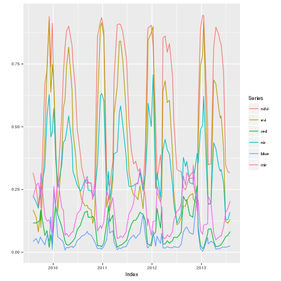
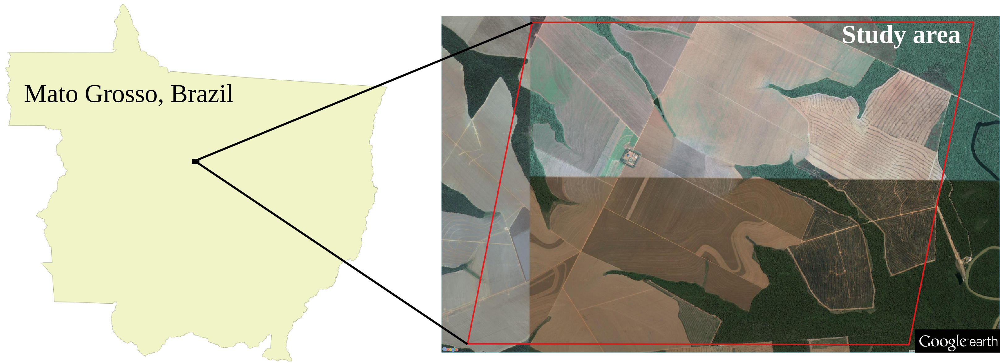
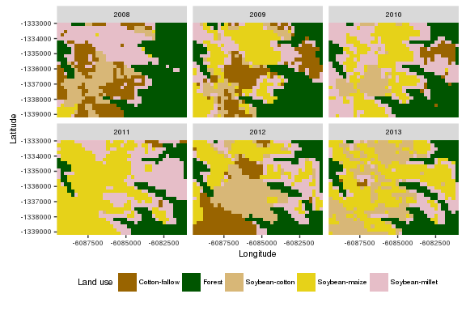

<!-- 
# Render README.md file  
rmarkdown::render("README.Rmd")
-->
dtwSat
======

### Time-Weighted Dynamic Time Warping for remote sensing time series analysis

dtwSat provides an implementation of Time-Weighted Dynamic Time Warping (TWDTW) for satellite image time series analysis and land use classification. It is useful to account for natural and cultivated vegetation types with inter-annual climatic and seasonal variability. Methods based on dynamic time warping are flexible to handle with irregular sampling and out of phase time series, and have achieved significant results in time series data mining. Bellow we show a quick demo of the package and a vignette for land use mapping using satellite image time series.

### Install

``` r
devtools::install_github("vwmaus/dtwSat")
```

### Quick demo

This dome performs the TWDTW analysis for the following `template` time series

``` r
library(dtwSat)
library(ggplot2)
autoplot(template, facets = NULL) + 
     theme(text = element_text(size = 8, family = "Helvetica"))
```


<p class="caption">
Typical temporal patterns.
</p>

whose subintervals we want to classify into one of the following crop types

``` r
plotPatterns(patterns.list) + 
     theme(text = element_text(size = 8, family = "Helvetica"))
```


<p class="caption">
Typical temporal patterns.
</p>

Therefore, we apply the TWDTW analysis using a logistic time-weight

``` r
weight.fun = logisticWeight(alpha=-0.1, beta=100)
alig = twdtw(x=template.list[[1]], patterns=patterns.list, 
             normalize.patterns = TRUE, patterns.length = 23,
             weight.fun = weight.fun, keep=TRUE) 
```

that retrieves an `twdtw` object with all possible alignments of the patterns to the template time series

``` r
class(alig)
print(alig)
summary(alig)
```

We can use several plot methods to visualize the resulting `twdtw` object. To plot alignments

``` r
plot(x = alig, type = "alignment") + 
     theme(text = element_text(size = 8, family = "Helvetica"))
```


<p class="caption">
Typical temporal patterns.
</p>

to plot matching point

``` r
plot(x = alig, type = "match", attr = "evi") + 
     theme(text = element_text(size = 8, family = "Helvetica"))
```


<p class="caption">
Typical temporal patterns.
</p>

to plot minimum cost paths

``` r
plot(type = "path", x = alig) + 
     theme(text = element_text(size = 8, family = "Helvetica"))
```


<p class="caption">
Typical temporal patterns.
</p>

or to classify and plot each subinterval of the template time series

``` r
plot(x = alig, type = "group",
     from = "2009-09-01", to = "2013-09-01", 
     by = "6 month", overlap = 0.3) + 
     theme(text = element_text(size = 8, family = "Helvetica"))
```


<p class="caption">
Typical temporal patterns.
</p>

Vignette - Land use classification using dtwSat
===============================================

<!-- 
 Comment 
-->
The [dtwSat](https://cran.r-project.org/web/packages/dtwSat/index.html) package provides an implementation of Time-Weighted Dynamic Time Warping for multi-band satellite image time series analysis. [dtwSat](https://cran.r-project.org/web/packages/dtwSat/index.html) also includes methods for analysis and visualization of results. In this vignette we show how to use the package for land use and land cover classification using satellite image time series. We use a small sample in a tropical forest area (in Mato Grosso, Brazil) and a set of field samples to build typical temporal patterns to perform the land use mapping.

Introduction
------------

The Time-Weighted Dynamic Time Warping (TWDTW) is adapted to multi-band satellite image time series analysis, and it is flexible to compare satellite time series even if they are irregularly sampled, or are out of phase in the time axis (cf. Maus et al. (2016) for details).

(Velichko and Zagoruyko 1970) (Hiroaki Sakoe and Chiba 1971) (H. Sakoe and Chiba 1978) (Rabiner and Juang 1993) (Berndt and Clifford 1994) (Müller 2007)

...

In the next sections we present the [input data][Input data] for the algorithm and show, step-by-step, how to perform the TWDTW analysis for satellite image time series. We start by [extracting the time series from the satellite images](#extract-time-series-and-create-temporal-patterns), and then we show how to [create the typical temporal patterns](#extract-time-series-and-create-temporal-patterns) for each land class. Using these temporal patterns we show the [land use mapping application](#land-use-mapping) that is followed by an [accuracy assessment](#accuracy-assessment).

Data
----

The inputs of the algorithm are: *i)* a sequence of satellite images ordered over time, and *ii)* a set of ground truth samples. The case study is in a tropical forest area, in Mato Grosso, Brazil, and the time domain ranges from 2007 to 2013. We also use a set of 603 ground truth samples of the following land classes: forest, cotton-fallow, soybean-cotton, soybean-maize, and soybean-millet.



Here we use the MODIS product [MOD13Q1](https://lpdaac.usgs.gov/dataset_discovery/modis/modis_products_table/mod13q1). This produt has 250 m spatial and 16 day temporal resolution, that means a sequence of 160 images with 999 pixels each, covering our study area from 2007 to 2013.

The folder *lucc\_MT* installed with [dtwSat](https://cran.r-project.org/web/packages/dtwSat/index.html) package provides the raster files and the ground truth samples for the study are. The raster files are ordered according to the time of the image acquisition in *GeoTIFF* format. Each file has 7 bands (ndvi, evi, red, nir, mir, blue, and doy) extracted from the MODIS product MOD13Q1. The ground truth samples are an *Esri Shapefile*. Besides the location, the shapefile also provides the time range (*from* *to*) and the land class (*group*) of each ground truth sample.

Build inputs
------------

[dtwSat](https://cran.r-project.org/web/packages/dtwSat/index.html) has interface to [raster](https://cran.r-project.org/web/packages/raster/index.html) and [sp](https://cran.r-project.org/web/packages/sp/index.html) packages. This way one can easily apply the TWDTW analysis for different areas and build temporal patterns using their own set of field samples.

We use the `raster` package to build a `list` of satellite bands time series, *i.e.* a `list` of raster `RasterBrick` or `RasterStack` objects. Each node in the list has one multi-layer raster object that has one satellite band ordered over time. All raster objects in the list must have the same temporal and spatial extension.

To build the raster time series we locate the *tif* files in the folder *lucc\_MT* (installed with [dtwSat](https://cran.r-project.org/web/packages/dtwSat/index.html) package). These files are ordered by time of the image acquisition, and therefore we can directly build a list of files using the following commands

``` r
library(dtwSat)
library(raster)
raster_dir = system.file('lucc_MT',  package = 'dtwSat')
raster_files_list = paste(raster_dir, dir(raster_dir, pattern = '.tif$'), sep = '/')
```

Using the function `lapply` and `raster::stack` we create a `list` of multi-layer `raster::RasterStack` objects (list of raster time series) for each band: ndvi, evi, red, nir, mir, such that

``` r
bands = 1:6
names(bands) = c('ndvi','evi','red','nir','mir','blue')
stack_list = lapply(bands, function(x)
          stack(raster_files_list, bands = x)
  )
```

and, optionally we can also build a `raster::RasterStack` of the real day of the year (doy) for each pixels

``` r
doy = stack(raster_files_list, bands = 7)
```

At this point our time series (i.e. the list of multi-layer raster objects) are without time reference. Therefore, the package **dtwSat** also provides the acquisition dates of the satellite images in `lucc_MT/timeline.csv`. The time information is also part of the name of the *tif* files, such as it usually comes from the data provider.

``` r
timeline = read.table(system.file('lucc_MT/timeline.csv', package = 'dtwSat'), as.is = TRUE)
```

To attach the `timeline` and `raster::RasterStack` objects we use the function `createRasterTimeSeries` that will retrieve a list of raster time series, which servers as the input for other functions of **dtwSat** package. Note that the access of time series from several *tif* files might become slow. Therefore, the function `createRasterTimeSeries` also provides an interface to `raster::writeRaster` and creates independent files for each time series, i.e. it creates one file for each band that allows us to use `raster::RasterBrick` instead of `raster::RasterStack` objects. As our example is small, we will use the `raster::RasterStack` object, such that

``` r
raster_timeseries = createRasterTimeSeries(x = stack_list, timeline = timeline[,1], doy = doy)
```

To create the typical temporal patterns we use the ground truth samples in the file *lucc\_MT/samples\_MT.shp*. Each point in the shapefile has the name of the land use class and the temporal range of the sample in the format of date (i.e. `yyyy-mm-dd`). This dataset has a total of 603 samples that are: 68 Cotton-fallow, 138 Forest, 79 Soybean-cotton, 134 Soybean-maize, and 184 Soybean-millet.

``` r
library(rgdal)
field_samples = readOGR(system.file('lucc_MT/samples_MT.shp', package="dtwSat"),
                        layer = "samples_MT")
```

``` r
names(field_samples)
```

    ## [1] "from"  "to"    "group"

``` r
table(field_samples$group)
```

    ## 
    ##  Cotton-fallow         Forest Soybean-cotton  Soybean-maize Soybean-millet 
    ##             68            138             79            134            184

Extract time series and create temporal patterns
------------------------------------------------

In this section we show how to create the typical temporal patterns for each land use class in the samples. For that we extract the time series for each sample from the `raster::RasterStack` list stored in `raster_timeseries`. The extraction process might take a few minutes because it has to read several raster files in order to get the complete time series (~4 minutes using 1 cores with 2.4 GHz clock). Note that the extraction is much faster if we use `raster::RasterBrick` instead of `raster::RasterStack` (~4.5 seconds using 1 cores with 2.4 GHz clock). Linux users can also speedup the processing by setting larger number of cores in the parameter `mc.cores`.

``` r
ts_list = extractTimeSeries(x = raster_timeseries, y = field_samples, mc.cores = 1)
```

<!-- 
t1=system.time(
  ts_list <- extractTimeSeries(x = raster_timeseries, y = field_samples, mc.cores = 1)
)
t2=system.time(
  ts_list <- extractTimeSeries(x = raster_timeseries, y = field_samples, mc.cores = 1)
)
-->
In the code bellow we use all time series extracted in the previous step to create typical temporal patterns for each class. The function `createPattern` uses a Generalised Additive Model (GAM) (cf. [mgcv](https://cran.r-project.org/web/packages/mgcv/index.html)) to create the temporal patterns. To use this function the user has to inform the start (`from`), the end (`to`), and the frequency in days of the desired output temporal patterns. Besides the user also has to provide a fitting formula for the `mgcv::gam` model (for details see [mgcv::gam](https://cran.r-project.org/web/packages/mgcv/index.html)). Here we set the output patterns with frequency of 8 days from "2004-09-01" to "2005-09-0", and cyclic cubic spline model, such that `y ~ s(time, bs="cc")`, where `time` is the independent variable and `y` is one of the satellite bands (for details see [mgcv::s](https://cran.r-project.org/web/packages/mgcv/index.html)).

``` r
groups = as.character(unique(field_samples$group))
names(groups) = groups
field_samples_list = lapply(groups, function(x) ts_list[field_samples$group==x])
patterns_list = lapply(field_samples_list, createPattern, 
                       freq = 8, formula = y ~ s(time, bs = "cc"))
```

This will give us the following temporal patterns

``` r
library(ggplot2)
plotPatterns(patterns_list) + 
  theme(text = element_text(size = 8, family="Helvetica"),
        legend.position = "bottom")
```


<p class="caption">
Typical temporal patterns.
</p>

Land use mapping
----------------

In this section we use [dtwSat](https://cran.r-project.org/web/packages/dtwSat/index.html) to classify our small study area in the Brazilian Amazon into land use types over time. The function `twdtwApply` performs the TWDTW analysis over all pixel locations and returns a `raster::RasterBrick` object whose layers have the final classification for each time period. To use this function we define some classification parameters, such that

``` r
## Time-weight function for TWDTW analysis. See ?twdtw for details 
weight.fun = logisticWeight(alpha=-0.1, beta=50)
## Classification function. See ?classifyIntervals for details
win.fun = classifyIntervals 
## Classification intervals and overlap. See ?classifyIntervals for details
breaks = seq(from=as.Date("2007-09-01"), to=as.Date("2013-09-01"), by = "12 month")
overlap = 0.5 
# Legend parameter. See ?classifyIntervals for details
levels = c(seq_along(patterns_list), 255)
labels = c(names(patterns_list), "Unclassified")
colors = c("#996400", "#005500", "#D8B777", "#E6D219", "#E6BEC8", "#C8C8C8")
names(colors) = labels
```

Note that we use `win.fun=classifyIntervals`, which classifies the time intervals of each pixel location based on the lowest TWDTW distance, i.e. a pixel based classification. The users can also define their own classification function using different rules, for example, by using the TWDTW distance of neighborhood.

For a `raster::RasterStack` object the total processing time of 999 time series is ~XXXX minutes using 1 cores with 2.4 GHz clock. This can be improved if we use `raster::RasterBrick` instead of `raster::RasterStack` (~4 minutes using 1 cores with 2.4 GHz clock). Linux users can also speedup the processing by setting larger number of cores in the parameter `mc.cores`.

``` r
land_use_maps = twdtwApply(x = raster_timeseries, patterns = patterns_list, 
                           mc.cores = 4, win.fun = win.fun, weight.fun = weight.fun, 
                           breaks = breaks, overlap = overlap, levels = levels, 
                           labels = labels, simplify= TRUE)
```

Lets now take a look at the classification results. This sequence of maps provided here is useful for land use changes analysis. Such results can be linked to other kind of datasets, e.g. commodities trading, and help in understanding the spatiotemporal connections of land use changes and its drivers.

``` r
plotLUCC(x = land_use_maps, type = "map", layer.labels = 2008:2013, 
         levels = levels, labels = labels, colors = colors) + 
         theme(text = element_text(size = 8, family="Helvetica"))
```


<p class="caption">
Typical temporal patterns.
</p>

For example, we can quantify the accumulated land use changes over time, or even the land use transitions from class to class over time, such that

``` r
plotLUCC(x = land_use_maps, type = "area", layer.labels = 2008:2013, 
         levels = levels, labels = labels, 
         colors = colors) + 
         theme(text = element_text(size = 8, family="Helvetica"))
```


<p class="caption">
Typical temporal patterns.
</p>

``` r
plotLUCC(x = land_use_maps, type = "change", layer.labels = 2008:2013, 
         levels = levels, labels = labels, colors = colors) + 
         theme(text = element_text(size = 8, family="Helvetica"))
```


<p class="caption">
Typical temporal patterns.
</p>

Accuracy assessment
-------------------

``` r
library(caret)
library(parallel)
library(reshape2)
n = 100 # Number of repetitions 
p = 0.1 # p% Training (1-p)% Validation 
set.seed(1)
training_sample = createDataPartition(y = field_samples$group, 
                                      times = n, p = 0.1, list = TRUE)

assess_list = lapply(training_sample, function(I){
  cat(".")
  # Split training and validation samples 
  ts_training_sample   = ts_list[ I]
  ts_validation_sample = ts_list[-I]
  sp_training_sample   = field_samples[ I,]
  sp_validation_sample = field_samples[-I,]
  
  # Group land-use classes 
  groups = as.character(unique(sp_training_sample$group))
  names(groups) = groups
  J = lapply(groups, function(x) 
    row.names(sp_training_sample)[sp_training_sample$group==x])
  
  # Create temporal patterns 
  samples_list = lapply(J, function(j) ts_training_sample[j] )
  patterns_list = lapply(samples_list, createPattern, freq=8, 
                         from="2007-09-01", to="2008-09-01",
                         formula = y ~ s(time, bs="cc"))
  # grid.arrange(grobs=lapply(patterns.list, autoplot, facets = NULL), ncol=3)

  # Apply twdtw for the validation samples 
  validation_results = mclapply(ts_validation_sample, FUN=twdtw, 
                              patterns = patterns_list, 
                              weight.fun = weight.fun, mc.cores=3)

  # Classify twdtw results
  s = names(validation_results)
  names(s) = s
  res = do.call("rbind", mclapply(s, mc.cores=3, function(i){
    from = sp_validation_sample[i,]$from
    to = sp_validation_sample[i,]$to
    pred = classifyIntervals(validation_results[[i]], 
                             from = from, to = to, 
                             by = "12 month",
                             overlap = overlap)
    data.frame(Reference = as.character(sp_validation_sample[i,]$group),
               Predicted = as.character(pred$pattern), stringsAsFactors = FALSE)
  }))
  return(res)
})
```

``` r
assess_results = do.call("rbind", lapply(assess_list, function(class_table){
  assess_table = table(Predicted=class_table$Predicted, Reference=class_table$Reference)
  user_accuracy = diag(assess_table) / rowSums(assess_table)
  prod_accuracy = diag(assess_table) / colSums(assess_table)
  data.frame(Group=names(user_accuracy), 
             User = user_accuracy,
             Producer = prod_accuracy)
}))
```

``` r
library(reshape2)
df = melt(assess_results, id="Group")
ggplot(df, aes(x=Group, y=value)) + 
  stat_summary(fun.data="median_hilow", width=0.5, geom="crossbar", fill="grey") + 
  geom_point() +  
  facet_grid(. ~ variable) + 
  scale_y_continuous(limits = c(0,1)) + 
  xlab("") + 
  ylab("Accuracy %") + 
  coord_flip()
```


<p class="caption">
Typical temporal patterns.
</p>

References
----------

Berndt, Donald J., and James Clifford. 1994. “Using Dynamic Time Warping to Find Patterns in Time Series.” In *KDD Workshop*, edited by Usama M. Fayyad and Ramasamy Uthurusamy, 359–70. AAAI Press.

Maus, Victor, Gilberto Câmara, Ricardo Cartaxo, Alber Sanchez, Fernando M. Ramos, and Gilberto R. de Queiroz. 2016. “A Time-Weighted Dynamic Time Warping method for land use and land cover mapping.” *Selected Topics in Applied Earth Observations and Remote Sensing, IEEE Journal of* 9 (X): XXXX–XX. doi:[10.1109/JSTARS.2016.2517118](http://dx.doi.org/10.1109/JSTARS.2016.2517118).

Müller, Meinard. 2007. *Information Retrieval for Music and Motion*. London: Springer.

Rabiner, Lawrence, and Biing-Hwang Juang. 1993. *Fundamentals of Speech Recognition*. Prentice-Hall International, Inc.

Sakoe, H., and S. Chiba. 1978. “Dynamic Programming Algorithm Optimization for Spoken Word Recognition.” *Acoustics, Speech and Signal Processing, IEEE Transactions on* 26 (1): 43–49. doi:[10.1109/TASSP.1978.1163055](http://dx.doi.org/10.1109/TASSP.1978.1163055).

Sakoe, Hiroaki, and Seibi Chiba. 1971. “A Dynamic Programming Approach to Continuous Speech Recognition.” In *Proceedings of the Seventh International Congress on Acoustics, Budapest*, 3:65–69. Budapest: Akadémiai Kiadó.

Velichko, V.M., and N.G. Zagoruyko. 1970. “Automatic Recognition of 200 Words.” *International Journal of Man-Machine Studies* 2 (3): 223–34. doi:[10.1016/S0020-7373(70)80008-6](http://dx.doi.org/10.1016/S0020-7373(70)80008-6).
