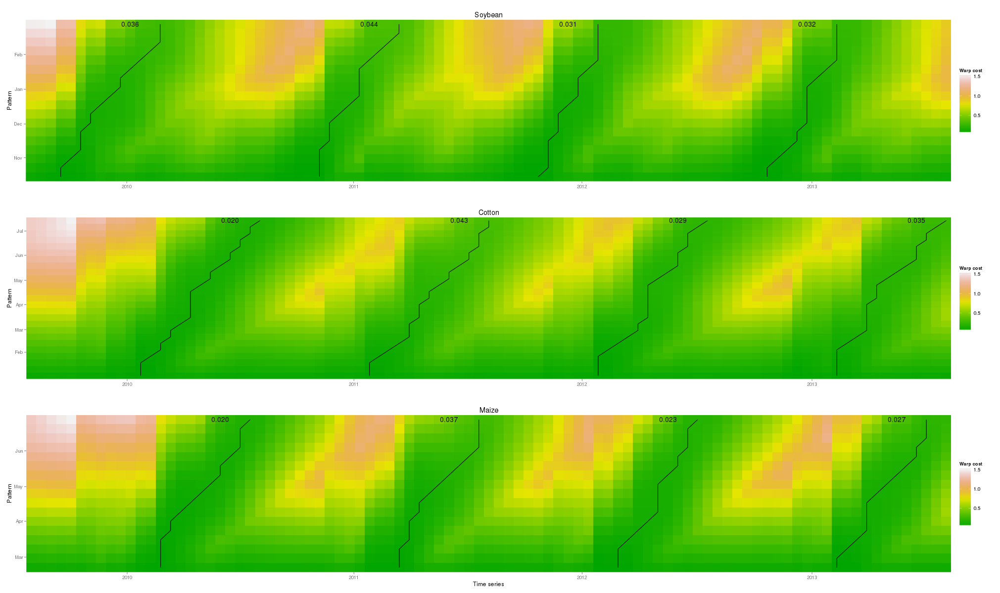

dtwSat
=====

Time-Weighted Dynamic Time Warping (TWDTW) for satellite image time series analysis

dtwSat extends the dtw R package for multidimensional satellite image time series analysis. 

<h3>How to use the package:</h3>
<ol>
	<li>Open R</li>
	<li>Install devtools <code>install.packages("devtools")</code></li>
	<li>Load devtools <code>library(devtools)</code></li>
	<li>Install the dtwSat package <code>install_github("vwmaus/dtwSat")</code></li>
</ol>

<h3>Examples:</h3>
<ol>
	<li>Load the dtwSat package: <code>library(dtwSat)</code></li>
	<li>Query names: <code>names(query.list)</code></li>
	<li>Run twdtw alignment for one query: <code>alig = twdtw(query.list[["Soybean"]], template, weight = "logistic", alpha = 0.1, beta = 50, alignments=4, keep=TRUE)</code></li>
	<li>Print dtwSat object: <code>print(alig)</code></li>
	<li>Plot dtwSat object: <code>plot(alig)</code></li>
</ol>

<h3>Plot examples:</h3>
<ol>
 	<li>Plot alignment for all classese:
 		<code>
			gp.list = lapply(query.list, function(query){
  				alig = twdtw(query, template, weight = "logistic", alpha = 0.1, beta = 50, alignments = 4, keep = TRUE)
  				plot(alig, normalize = TRUE, show.dist = TRUE)  
			})
			grid.arrange(arrangeGrob(
				gp.list[[1]] + ggtitle(names(query.list)[1]) + theme(axis.title.x=element_blank()),
                         	gp.list[[2]] + ggtitle(names(query.list)[2]) + theme(axis.title.x=element_blank()),
                         	gp.list[[3]] + ggtitle(names(query.list)[3]) ,
                         	nrow=3))
                </code>
        </li>
</ol>

<ol>
  <li>Plot alignments: <code>
  	gp1 = plot(alig, type="alignment", dimension="evi", alignment=1, shift=0.5)
	gp2 = plot(alig, type="alignment", dimension="evi", alignment=2, shift=0.5)
	grid.arrange(arrangeGrob(
		gp1 + ggtitle("Alignment 1") + theme(axis.title.x=element_blank(), legend.position="none"),
                gp2 + ggtitle("Alignment 2") + theme(axis.title.x=element_blank(), legend.position="none"),
                nrow=2))
        </code>
   </li>
</ol>
  

<h3>How to build the package:</h3>
<ol>
	<li>Clone the project: <code>git clone https//github.com/vwmaus/dtwSat.git</code>.</li>
	<li>Open Rstudio, go to File - Open Project and pick the file <code>dtwSat.Rproj</code>.</li>
	<li>Install the required packages <code>install.packages(c("roxygen2", "testthat"))</code>.</li>
	<li>Go to the <i>Build</i> tab in the upper-right panel and press the button <i>Build & Reload</i>. After this the package is ready to use.</li>
	<li>You can also create a source package: Go to the <i>Build</i> tab, display the menu <i>More</i> and select the option <i>Build Source Package</i>.</li>
</ol> 
