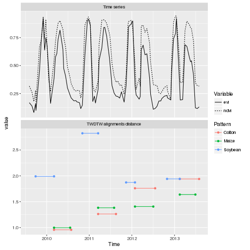
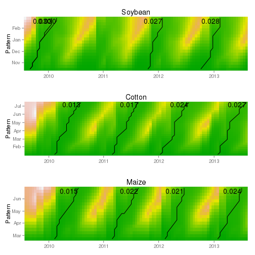
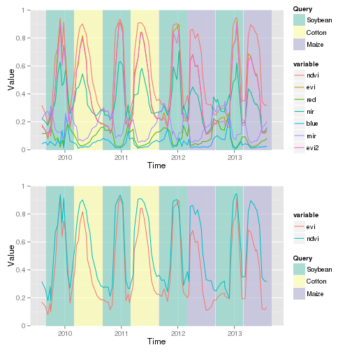
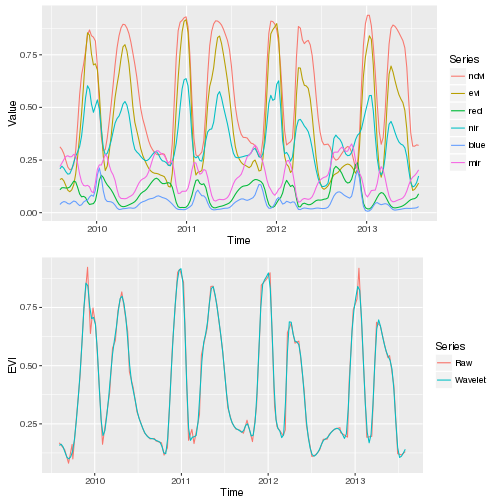

---
output:
  md_document:
    variant: markdown_github
---

<!-- README.md is generated from README.Rmd. Please edit that file -->

dtwSat
=====

### Time-Weighted Dynamic Time Warping for remote sensing time series analysis
The dtwSat provides a Time-Weighted Dynamic Time Warping (TWDTW) algorithm to measure similarity between two temporal sequences. This adaptation of the classical Dynamic Time Warping (DTW) algorithm is flexible to compare events that have a strong time dependency, such as phenological stages of cropland systems and tropical forests. This package provides methods for visualization of minimum cost paths, time series alignment, and time intervals classification.

### Install

```r
devtools::install_github("vwmaus/dtwSat")
```


### Quick demo

This dome performs a dtwSat analysis and show the results.

```r
library(dtwSat)
```

```
## Loading required package: dtw
## Loading required package: proxy
## 
## Attaching package: 'proxy'
## 
## The following objects are masked from 'package:stats':
## 
##     as.dist, dist
## 
## The following object is masked from 'package:base':
## 
##     as.matrix
## 
## Loaded dtw v1.18-1. See ?dtw for help, citation("dtw") for use in publication.
## 
## Loading required package: zoo
## 
## Attaching package: 'zoo'
## 
## The following objects are masked from 'package:base':
## 
##     as.Date, as.Date.numeric
## 
## Loaded dtwSat v0.0.1. See ?dtwSat for help, citation("dtwSat") for use in publication.
```

```r
names(query.list)
```

```
## [1] "Soybean" "Cotton"  "Maize"
```

```r
alig = twdtw(query.list[["Soybean"]], template, 
             weight = "logistic", alpha = 0.1, beta = 50, alignments=4, keep=TRUE) 
print(alig)
```

```
## Time-Weighted DTW alignment object
## Number of alignments: 4 
##   query       from         to distance normalizedDistance
## 1     1 2011-10-04 2012-01-28 3.956483         0.03140066
## 2     1 2012-10-06 2013-02-15 4.008838         0.03181617
## 3     1 2009-09-13 2010-03-05 4.539202         0.03602541
## 4     1 2010-10-20 2011-03-18 5.528445         0.04387655
```

### Plot examples

Plot alignments

```r
library(dtwSat)
library(ggplot2)
library(gridExtra)
gp1 = plot(alig, type="alignment", attribute="evi", alignment=1, shift=0.5) + 
          ggtitle("Alignment 1") +
		      theme(axis.title.x=element_blank())
gp2 = plot(alig, type="alignment", attribute="evi", alignment=2, shift=0.5) +
          ggtitle("Alignment 2") + 
          theme(legend.position="none")
grid.arrange(gp1,gp2,nrow=2)
```

 


Plot path for all classese

```r
library(dtwSat)
library(ggplot)
```

```
## Error in library(ggplot): there is no package called 'ggplot'
```

```r
library(gridExtra)
gp.list = lapply(query.list, function(query){
  				alig = twdtw(query, template, weight = "logistic", alpha = 0.1, 
  				             beta = 100, alignments = 4, keep = TRUE)
  				plot(alig, normalize = TRUE, show.dist = TRUE) + 
  				  theme(axis.title.x=element_blank(),
  				        legend.position="none")
})
grid.arrange(gp.list[[1]] + ggtitle(names(query.list)[1]),
             gp.list[[2]] + ggtitle(names(query.list)[2]),
             gp.list[[3]] + ggtitle(names(query.list)[3]),
             nrow=3)
```

 

Plot classification

```r
library(dtwSat)
library(ggplot2)
library(gridExtra)
malig = mtwdtw(query.list, template, weight = "logistic", 
        alpha = 0.1, beta = 100)
 
gp1 = plot(x=malig, type="classify", from=as.Date("2009-09-01"),  
     to=as.Date("2013-09-01"), by = "6 month",
     normalized=TRUE, overlap=.7) 

gp2 = plot(x=malig, type="classify", attribute = c("evi","ndvi"),
           from=as.Date("2009-09-01"), to=as.Date("2013-09-01"), 
           by = "6 month", normalized=TRUE, overlap=.7)

grid.arrange(gp1,gp2,nrow=2)
```

 


Plot wavelet smoothing

```r
library(dtwSat)
library(ggplot2)
library(reshape2)
library(gridExtra)
sy = waveletSmoothing(x=template, frequency=8, wf = "la8", J=1, 
                      boundary = "periodic")
df1 = data.frame(Time=index(template), value=template$evi, variable="Raw")
df1 = rbind(df1, data.frame(Time=index(sy), value=sy$evi, variable="Wavelet filter") )
gp1 = ggplot(df1, aes(x=Time, y=value, group=variable, colour=variable)) +
   		geom_line() + 
  		# theme(legend.position="bottom") +
  		ylab("EVI")

df2 = melt(data.frame(Time=index(sy), sy), id="Time")
gp2 = ggplot(df2, aes(x=Time, y=value, group=variable, colour=variable)) +
   		geom_line() + 
  		ylab("Value") 

grid.arrange(gp1,gp2,nrow=2)
```

 


