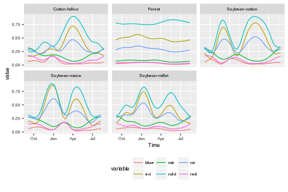
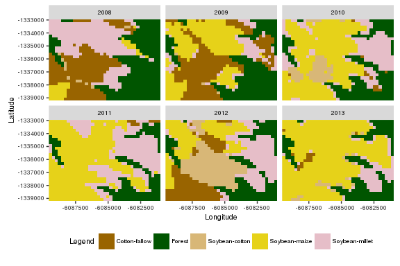
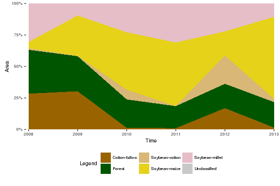
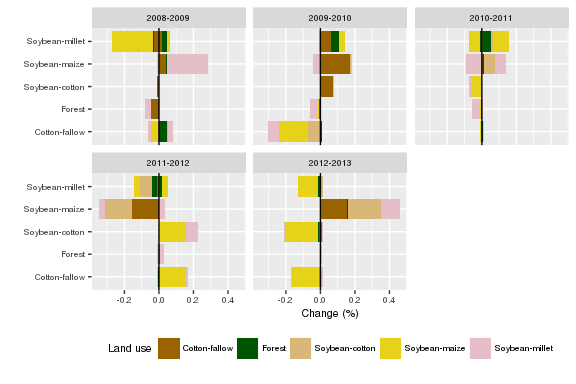
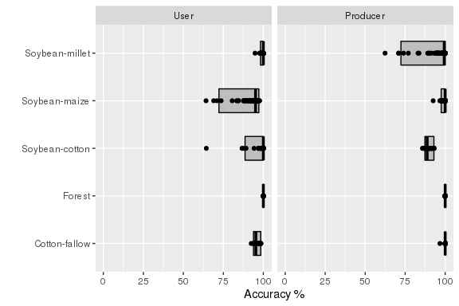

[dtwSat](https://cran.r-project.org/web/packages/dtwSat/index.html) implements the Time-Weighted Dynamic Time Warping (TWDTW) for multi-band satellite image time series analysis. It includes methods for analysis and visualization of results and for land use and land cover changes analysis. In this chapter we present an application for land use and land cover changes analysis using satellite image time series. We show step-by-step how to create typical temporal patterns using field samples and how to perform the TWDTW analysis for time series stored as sequence of raster files. In the end of this chapter we also present an example of land use and land cover changes analysis as well as the accuracy assessment.

Introduction
------------

Land use and land cover changes studies require accurate spatiotemporal data that usually is not available for many regions of the world (Fritz et al. 2013). This has lead to much recent development of automated and semiautomated methods for use and land cover classification, *e.g* land cover mapping (Griffiths et al. 2013), detecting forest disturbance and recovery (Kennedy, Yang, and Cohen 2010; Zhu, Woodcock, and Olofsson 2012; DeVries et al. 2015), crop classification (Xiao et al. 2005; Wardlow, Egbert, and Kastens 2007; Petitjean, Inglada, and Gancarski 2012; Maus et al. 2016), planted forest mapping (Maire et al. 2014), and crop expansion and intensification [Galford:2008; Sakamoto:2009]. Particularly, the Time-Weighted Dynamic Time Warping (TWDTW) by (Maus et al. 2016) is flexible to account for multiyear crops, single cropping and double cropping. It is also robust to account for other land cover types such as forest and pasture and works with a small amount of training samples.

The aim of this chapter is to present an example of land use and land cover changes analysis using [dtwSat](https://cran.r-project.org/web/packages/dtwSat/index.html). For that we run a TWDTW analysis in a small area with rapid land use changes in Mato Grosso, Brazil. We also present and a land use changes analysis as well as the accuracy assessment.

Data
----

The inputs of the algorithm are: *i)* a sequence of satellite images ordered over time, and *ii)* a set of ground truth samples. The case study is in a tropical forest area, in Mato Grosso, Brazil, and the time domain ranges from 2007 to 2013. We also use a set of 603 ground truth samples of the following land classes: forest, cotton-fallow, soybean-cotton, soybean-maize, and soybean-millet.


Here we use the MODIS product [MOD13Q1](https://lpdaac.usgs.gov/dataset_discovery/modis/modis_products_table/mod13q1). This produt has 250 m spatial and 16 day temporal resolution, that means a sequence of 160 images with 999 pixels each, covering our study area from 2007 to 2013.

The folder *lucc\_MT* installed with [dtwSat](https://cran.r-project.org/web/packages/dtwSat/index.html) package provides the raster files and the ground truth samples for the study are. The raster files are ordered according to the time of the image acquisition in *GeoTIFF* format. Each file has 7 bands (ndvi, evi, red, nir, mir, blue, and doy) extracted from the MODIS product MOD13Q1. The ground truth samples are an *Esri Shapefile*. Besides the location, the shapefile also provides the time range (*from* *to*) and the land class (*group*) of each ground truth sample.

Build inputs
------------

[dtwSat](https://cran.r-project.org/web/packages/dtwSat/index.html) has interface to [raster](https://cran.r-project.org/web/packages/raster/index.html) and [sp](https://cran.r-project.org/web/packages/sp/index.html) packages. This way one can easily apply the TWDTW analysis for different areas and build temporal patterns using their own set of field samples.

We use the `raster` package to build a `list` of satellite bands time series, *i.e.* a `list` of raster `RasterBrick` or `RasterStack` objects. Each node in the list has one multi-layer raster object that has one satellite band ordered over time. All raster objects in the list must have the same temporal and spatial extension.

To build the raster time series we locate the *tif* files in the folder *lucc\_MT* (installed with [dtwSat](https://cran.r-project.org/web/packages/dtwSat/index.html) package). These files are ordered by time of the image acquisition, and therefore we can directly build a list of files using the following commands

``` r
library(dtwSat)
library(raster)
raster_dir = system.file('lucc_MT',  package = 'dtwSat')
raster_files_list = paste(raster_dir, dir(raster_dir, pattern = '.tif$'), sep = '/')
```

Using the function `lapply` and `raster::stack` we create a `list` of multi-layer `raster::RasterStack` objects (list of raster time series) for each band: ndvi, evi, red, nir, mir, such that

``` r
bands = 1:6
names(bands) = c('ndvi','evi','red','nir','mir','blue')
stack_list = lapply(bands, function(x)
          stack(raster_files_list, bands = x)
  )
```

and, optionally we can also build a `raster::RasterStack` of the real day of the year (doy) for each pixels

``` r
doy = stack(raster_files_list, bands = 7)
```

At this point our time series (i.e. the list of multi-layer raster objects) are without time reference. Therefore, the package **dtwSat** also provides the acquisition dates of the satellite images in `lucc_MT/timeline.csv`. The time information is also part of the name of the *tif* files, such as it usually comes from the data provider.

``` r
timeline = read.table(system.file('lucc_MT/timeline.csv', package = 'dtwSat'), as.is = TRUE)
```

To attach the `timeline` and `raster::RasterStack` objects we use the function `createRasterTimeSeries` that will retrieve a list of raster time series, which servers as the input for other functions of **dtwSat** package. Note that the access of time series from several *tif* files might become slow. Therefore, the function `createRasterTimeSeries` also provides an interface to `raster::writeRaster` and creates independent files for each time series, i.e. it creates one file for each band that allows us to use `raster::RasterBrick` instead of `raster::RasterStack` objects. As our example is small, we will use the `raster::RasterStack` object, such that

``` r
raster_timeseries = createRasterTimeSeries(x = stack_list, timeline = timeline[,1], doy = doy)
```

To create the typical temporal patterns we use the ground truth samples in the file *lucc\_MT/samples\_MT.shp*. Each point in the shapefile has the name of the land use class and the temporal range of the sample in the format of date (i.e. `yyyy-mm-dd`). This dataset has a total of 603 samples that are: 68 Cotton-fallow, 138 Forest, 79 Soybean-cotton, 134 Soybean-maize, and 184 Soybean-millet.

``` r
library(rgdal)
field_samples = readOGR(system.file('lucc_MT/samples_MT.shp', package="dtwSat"),
                        layer = "samples_MT")
```

``` r
names(field_samples)
table(field_samples$group)
```

Extract time series and create temporal patterns
------------------------------------------------

In this section we show how to create the typical temporal patterns for each land use class in the samples. For that we extract the time series for each sample from the `raster::RasterStack` list stored in `raster_timeseries`. The extraction process might take a few minutes because it has to read several raster files in order to get the complete time series (~4 minutes using 1 cores with 2.4 GHz clock). Note that the extraction is much faster if we use `raster::RasterBrick` instead of `raster::RasterStack` (~4.5 seconds using 1 cores with 2.4 GHz clock). Linux users can also speedup the processing by setting larger number of cores in the parameter `mc.cores`.

``` r
ts_list = extractTimeSeries(x = raster_timeseries, y = field_samples, mc.cores = 1)
```

<!-- 
t1=system.time(
  ts_list <- extractTimeSeries(x = raster_timeseries, y = field_samples, mc.cores = 1)
)
t2=system.time(
  ts_list <- extractTimeSeries(x = raster_timeseries, y = field_samples, mc.cores = 1)
)
-->
In the code bellow we use all time series extracted in the previous step to create typical temporal patterns for each class. The function `createPattern` uses a Generalised Additive Model (GAM) (cf. [mgcv](https://cran.r-project.org/web/packages/mgcv/index.html)) to create the temporal patterns. To use this function the user has to inform the start (`from`), the end (`to`), and the frequency in days of the desired output temporal patterns. Besides the user also has to provide a fitting formula for the `mgcv::gam` model (for details see [mgcv::gam](https://cran.r-project.org/web/packages/mgcv/index.html)). Here we set the output patterns with frequency of 8 days from "2004-09-01" to "2005-09-0", and cyclic cubic spline model, such that `y ~ s(time, bs="cc")`, where `time` is the independent variable and `y` is one of the satellite bands (for details see [mgcv::s](https://cran.r-project.org/web/packages/mgcv/index.html)).

``` r
groups = as.character(unique(field_samples$group))
names(groups) = groups
field_samples_list = lapply(groups, function(x) ts_list[field_samples$group==x])
patterns_list = lapply(field_samples_list, createPattern, 
                       freq = 8, formula = y ~ s(time, bs = "cc"))
```

This will give us the following temporal patterns

``` r
library(ggplot2)
plotPatterns(patterns_list) + 
  theme(text = element_text(size = 8, family="Helvetica"),
        legend.position = "bottom")
```



Land use mapping
----------------

In this section we use [dtwSat](https://cran.r-project.org/web/packages/dtwSat/index.html) to classify our small study area in the Brazilian Amazon into land use types over time. The function `twdtwApply` performs the TWDTW analysis over all pixel locations and returns a `raster::RasterBrick` object whose layers have the final classification for each time period. To use this function we define some classification parameters, such that

``` r
## Time-weight function for TWDTW analysis. See ?twdtw for details 
weight.fun = logisticWeight(alpha=-0.1, beta=50)
## Classification function. See ?classifyIntervals for details
win.fun = classifyIntervals 
## Classification intervals and overlap. See ?classifyIntervals for details
breaks = seq(from=as.Date("2007-09-01"), to=as.Date("2013-09-01"), by = "12 month")
overlap = 0.5 
# Legend parameter. See ?classifyIntervals for details
levels = c(seq_along(patterns_list), 255)
labels = c(names(patterns_list), "Unclassified")
colors = c("#996400", "#005500", "#D8B777", "#E6D219", "#E6BEC8", "#C8C8C8")
names(colors) = labels
```

Note that we use `win.fun=classifyIntervals`, which classifies the time intervals of each pixel location based on the lowest TWDTW distance, i.e. a pixel based classification. The users can also define their own classification function using different rules, for example, by using the TWDTW distance of neighborhood.

For a `raster::RasterStack` object the total processing time of 999 time series is ~XXXX minutes using 1 cores with 2.4 GHz clock. This can be improved if we use `raster::RasterBrick` instead of `raster::RasterStack` (~4 minutes using 1 cores with 2.4 GHz clock). Linux users can also speedup the processing by setting larger number of cores in the parameter `mc.cores`.

``` r
land_use_maps = twdtwApply(x = raster_timeseries, patterns = patterns_list, 
                           mc.cores = 4, win.fun = win.fun, weight.fun = weight.fun, 
                           breaks = breaks, overlap = overlap, levels = levels, 
                           labels = labels, simplify= TRUE)
```

Lets now take a look at the classification results. This sequence of maps provided here is useful for land use changes analysis. Such results can be linked to other kind of datasets, e.g. commodities trading, and help in understanding the spatiotemporal connections of land use changes and its drivers.

``` r
plotLUCC(x = land_use_maps, type = "map", layer.labels = 2008:2013, 
         levels = levels, labels = labels, colors = colors) + 
         theme(text = element_text(size = 8, family="Helvetica"))
```



For example, we can quantify the accumulated land use changes over time, or even the land use transitions from and to each land class over time, such that

``` r
plotLUCC(x = land_use_maps, type = "area", layer.labels = 2008:2013, 
         levels = levels, labels = labels, 
         colors = colors) + 
         theme(text = element_text(size = 8, family="Helvetica"))
```



``` r
plotLUCC(x = land_use_maps, type = "change", layer.labels = 2008:2013, 
         levels = levels, labels = labels, colors = colors) + 
         theme(text = element_text(size = 8, family="Helvetica"))
```



Accuracy assessment
-------------------

``` r
library(caret)
library(parallel)
library(reshape2)
n = 100 # Number of repetitions 
p = 0.1 # p% Training (1-p)% Validation 
set.seed(1)
training_sample = createDataPartition(y = field_samples$group, 
                                      times = n, p = 0.1, list = TRUE)

assess_list = lapply(training_sample, function(I){
  cat(".")
  # Split training and validation samples 
  ts_training_sample   = ts_list[ I]
  ts_validation_sample = ts_list[-I]
  sp_training_sample   = field_samples[ I,]
  sp_validation_sample = field_samples[-I,]
  
  # Group land-use classes 
  groups = as.character(unique(sp_training_sample$group))
  names(groups) = groups
  J = lapply(groups, function(x) 
    row.names(sp_training_sample)[sp_training_sample$group==x])
  
  # Create temporal patterns 
  samples_list = lapply(J, function(j) ts_training_sample[j] )
  patterns_list = lapply(samples_list, createPattern, freq=8, 
                         from="2007-09-01", to="2008-09-01",
                         formula = y ~ s(time, bs="cc"))
  # grid.arrange(grobs=lapply(patterns.list, autoplot, facets = NULL), ncol=3)

  # Apply twdtw for the validation samples 
  validation_results = mclapply(ts_validation_sample, FUN=twdtw, 
                              patterns = patterns_list, 
                              weight.fun = weight.fun, mc.cores=3)

  # Classify twdtw results
  s = names(validation_results)
  names(s) = s
  res = do.call("rbind", mclapply(s, mc.cores=3, function(i){
    from = sp_validation_sample[i,]$from
    to = sp_validation_sample[i,]$to
    pred = classifyIntervals(validation_results[[i]], 
                             from = from, to = to, 
                             by = "12 month",
                             overlap = overlap)
    data.frame(Reference = as.character(sp_validation_sample[i,]$group),
               Predicted = as.character(pred$pattern), stringsAsFactors = FALSE)
  }))
  return(res)
})
```

``` r
assess_results = do.call("rbind", lapply(assess_list, function(class_table){
  assess_table = table(Predicted=class_table$Predicted, Reference=class_table$Reference)
  user_accuracy = diag(assess_table) / rowSums(assess_table)
  prod_accuracy = diag(assess_table) / colSums(assess_table)
  data.frame(Group=names(user_accuracy), 
             User = user_accuracy,
             Producer = prod_accuracy)
}))
```

``` r
library(reshape2)
library(scales)
df = melt(assess_results, id="Group")
ggplot(df, aes(x=Group, y=value)) + 
  stat_summary(fun.data="median_hilow", width=0.5, geom="crossbar", fill="grey") + 
  geom_point() +  
  facet_grid(. ~ variable) + 
  scale_y_continuous(limits = c(0,1), labels = scales::percent) + 
  xlab("") + 
  ylab("Accuracy") + 
  coord_flip()
```



### Conclusions

[dtwSat](https://cran.r-project.org/web/packages/dtwSat/index.html) provides an accurate interface for R users to carry out land use and land cover changes analysis. Its interface to [raster](<https://cran.r-project.org/web/packages/raster/index.html>, [sp](https://cran.r-project.org/web/packages/sp/index.html), and [mgcv](https://cran.r-project.org/web/packages/mgcv/index.html) allows users to create their own temporal patterns and to perform TWDTW analysis using remote sensing time series.

To get good results the TWDTW algorithm, the spatial and temporal resolutions of the data should capture the properties of the landscape, and the pattern samples should also represent well the temporal variation of land cover. If these conditions are met, we expect that the TWDTW algorithm will be successful for large-scale land cover classification of remote sensing time series.

References
----------

DeVries, Ben, Jan Verbesselt, Lammert Kooistra, and Martin Herold. 2015. “Robust Monitoring of Small-Scale Forest Disturbances in a Tropical Montane Forest Using Landsat Time Series.” *Remote Sensing of Environment* 161 (0): 107–21. doi:[http://dx.doi.org/10.1016/j.rse.2015.02.012](http://dx.doi.org/http://dx.doi.org/10.1016/j.rse.2015.02.012).

Fritz, Steffen, Linda See, Liangzhi You, Chris Justice, Inbal Becker-Reshef, Lieven Bydekerke, Renato Cumani, et al. 2013. “The Need for Improved Maps of Global Cropland.” *Eos, Transactions American Geophysical Union* 94 (3): 31–32. doi:[10.1002/2013EO030006](http://dx.doi.org/10.1002/2013EO030006).

Griffiths, P., S. van der Linden, T. Kuemmerle, and P. Hostert. 2013. “A Pixel-Based Landsat Compositing Algorithm for Large Area Land Cover Mapping.” *Selected Topics in Applied Earth Observations and Remote Sensing, IEEE Journal of* 6 (5): 2088–2101. doi:[10.1109/JSTARS.2012.2228167](http://dx.doi.org/10.1109/JSTARS.2012.2228167).

Kennedy, Robert E., Zhiqiang Yang, and Warren B. Cohen. 2010. “Detecting Trends in Forest Disturbance and Recovery Using Yearly Landsat Time Series: 1. LandTrendr – Temporal Segmentation Algorithms.” *Remote Sensing of Environment* 114 (12): 2897–2910. doi:[http://dx.doi.org/10.1016/j.rse.2010.07.008](http://dx.doi.org/http://dx.doi.org/10.1016/j.rse.2010.07.008).

Maire, Guerric le, Stéphane Dupuy, Yann Nouvellon, Rodolfo Araujo Loos, and Rodrigo Hakamada. 2014. “Mapping Short-Rotation Plantations at Regional Scale Using MODIS Time Series: Case of Eucalypt Plantations in Brazil.” *Remote Sensing of Environment* 152 (0): 136–49. doi:[http://dx.doi.org/10.1016/j.rse.2014.05.015](http://dx.doi.org/http://dx.doi.org/10.1016/j.rse.2014.05.015).

Maus, Victor, Gilberto Câmara, Ricardo Cartaxo, Alber Sanchez, Fernando M. Ramos, and Gilberto R. de Queiroz. 2016. “A Time-Weighted Dynamic Time Warping method for land use and land cover mapping.” *Accepted for Publication in IEEE Journal of Selected Topics in Applied Earth Observations and Remote Sensing* 9 (X): XXXX–XX.

Petitjean, F., J. Inglada, and P. Gancarski. 2012. “Satellite Image Time Series Analysis Under Time Warping.” *Geoscience and Remote Sensing, IEEE Transactions on* 50 (8): 3081–95. doi:[10.1109/TGRS.2011.2179050](http://dx.doi.org/10.1109/TGRS.2011.2179050).

Wardlow, Brian D., Stephen L. Egbert, and Jude H. Kastens. 2007. “Analysis of Time-Series MODIS 250 M Vegetation Index Data for Crop Classification in the U.S. Central Great Plains.” *Remote Sensing of Environment* 108 (3): 290–310. doi:[http://dx.doi.org/10.1016/j.rse.2006.11.021](http://dx.doi.org/http://dx.doi.org/10.1016/j.rse.2006.11.021).

Xiao, Xiangming, Stephen Boles, Jiyuan Liu, Dafang Zhuang, Steve Frolking, Changsheng Li, William Salas, and Berrien Moore III. 2005. “Mapping Paddy Rice Agriculture in Southern China Using Multi-Temporal MODIS Images.” *Remote Sensing of Environment* 95 (4): 480–92. doi:[http://dx.doi.org/10.1016/j.rse.2004.12.009](http://dx.doi.org/http://dx.doi.org/10.1016/j.rse.2004.12.009).

Zhu, Zhe, Curtis E. Woodcock, and Pontus Olofsson. 2012. “Continuous Monitoring of Forest Disturbance Using All Available Landsat Imagery.” *Remote Sensing of Environment* 122 (0): 75–91. doi:[http://dx.doi.org/10.1016/j.rse.2011.10.030](http://dx.doi.org/http://dx.doi.org/10.1016/j.rse.2011.10.030).

[1] National Institute for Space Research, Avenida dos Astronautas 1758, 12227010, São José dos Campos, Brazil.

[2] Institute for Geoinformatics, University of Münster, Heisenbergstraße 2, 48149 Münster, Germany
