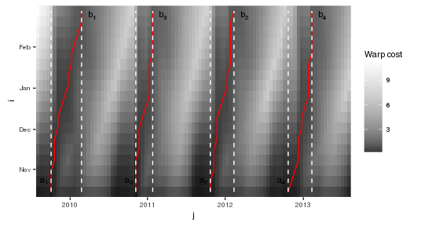

TWDTW is an adaptation of the classical Dynamic Time Warping (DTW) algorithm that includes a time-weight as a global constraint to perform the alignment. This is particularly useful when the temporal pattern is much shorter than the target time series, and to compare time series of phenomenons with strong time dependency, such as phenological stages of the vegetation observed in remote sensing time series (Maus et al. 2016). TWDTW finds the possible alignments of a well known temporal pattern within a long-term satellite image time series and gives a similarity measure for each alignment.

### Introduction

Remote sensors have collected large amount of data bringing unique information about the Earth. This archive of satellite images builds up into time series, which allow studying and better understanding the Earth system. However, inter- and intra-annual variability of some Earth system processes combined with noise and gaps in remotely sensed data have challenged the satellite data analysis. Recently, there has been a great effort to develop new methods capable of dealing with irregularly sampled and out-of-phase remote sensing time series.

Methods based on Dynamic Time Warping (DTW) are flexible to handle irregular sampling and out-of-phase time series, and they have achieved significant results in time series data mining (Rabiner and Juang 1993; Berndt and Clifford 1994; Keogh and Ratanamahatana 2005; Müller 2007). Originally, DTW was developed to compare speech records (Velichko and Zagoruyko 1970; Hiroaki Sakoe and Chiba 1971; H. Sakoe and Chiba 1978) but it has shown great potential in other areas, such as, in remote sensing (Petitjean, Inglada, and Gancarski 2012; Maus et al. 2016). Here we describe the Time-Weighted Dynamic Time Warping (TWDTW) algorithm for satellite images time series analysis proposed by Maus et al. (2016).

The original dynamic time warping method works well for shape matching but it is not suited for remote sensing time series classification. This is because it disregards the temporal range when finding the best alignment between two time series. Each land cover class has a specific phenological cycle, and therefore, a good time-series land cover classifier needs to balance between shape matching and temporal alignment. To that end, Maus et al. (2016) included a temporal weight to the original dynamic time warping method that accounts for seasonality of land cover types.

The aim of the chapter is to describe the Time-Weighted Dynamic Time Warping algorithm such as it is implemented in [dtwSat](https://cran.r-project.org/web/packages/dtwSat/index.html) package. in the next sections we show the steps of the algorithm and highlight the differences compared to the original Dynamic Time Warping algorithm.

### Notation

Let \(\mathcal{X}\) be a satellite image time series, such that, \(\mathcal{X}=\{\mathbf{x}(t_1), \mathbf{x}(t_2),\, ...,\, \mathbf{x}(t_m)\}\) where \(t\) is the time when a set of measurements \(\mathbf{x}\) where taken, *i.e.* \(\mathbf{x}(t)=\{x_1(t),\, x_2(t),\, ...,\, x_q(t)\}\) and \(q\) is the number of measurements. Let us define a second time series \(\mathcal{Y}=\{\mathbf{y}(t_1), \mathbf{y}(t_2),\, ...,\, \mathbf{y}(t_n)\}\) with the same attributes as \(\mathcal{X}\), however much shorter than that, *i.e* \(n \ll m\). If \(\mathcal{X}\) is an unknown time series and \(\mathcal{Y}\) a well known temporal profile of an event in the earth surface observed through satellite images, we might be interested in the following questions: *i)* How many intervals of \(\mathcal{X}\) are similar to \(\mathcal{Y}\)?, and *ii)* How similar to \(\mathcal{Y}\) these intervals of \(\mathcal{X}\) are? To answer to these questions we follow the workflow in the figure bellow that shows the steps of the algorithm to find the alignments between two time series.

Workflow showing the steps to find the alignments between the time series \(\mathcal{X}\) and \(\mathcal{Y}\).

### Local cost matrix computation

As showed before the algorithm starts by computing a local cost matrix \(\Psi(\mathcal{X},\mathcal{Y})\) \(n\)-by-\(m\), whose elements are given by \[
    \psi_{j,i} = 
    \phi(\mathbf{x}(t_j),\mathbf{y}(t_i))+
    \omega(t_j,t_i),
    \;j=1,...,m,
    \; \textrm{and}\;i=1,...,n.
    \label{eq:local_cost}
\] Where \(\phi\) is a distance function and \(\omega\) is the time weight function. Most of the DTW approaches define \(\phi\) as an Euclidean distance. The time weight \(\omega\) is what distinguishes TWDTW from DTW, *i.e* if \(\omega=0\) then the equation bellow has the same form as the original DTW formulation. The time weight \(\omega\) depends on the time \(t\) when the satellite image was collected. Maus et al. (2016) proposed two functions to compute the temporal weight, a linear with slope \(\theta\) \[
    \omega_{j,i} = \theta g(t_j,t_i),
    \label{eq:lineartw}
\] and a logistic model with midpoint \(\beta\), and steepness \(\alpha\), given by \[
    \omega_{j,i} = \frac{1}{1 + e^{-\alpha(g(t_j,t_i)-\beta)} }.
    \label{eq:nonlineartw}
\] The function \(g(t_j,t_i)\) is the elapsed time in days between the dates \(t_j\) in the time series \(\mathcal{X}\) and \(t_i\) in the time series \(\mathcal{Y}\). The time weighting creates a global constraint reducing the chances of a temporal inconsistent matching, such as, the alignment of a summer crop profile to the winter period. The figure bellow shows an example of local cost matrix for DTW and Time-Weighted DTW.

Examples of local cost matrix for DTW and Time-Weighted DTW algorithms. The matrix in the top has no time weight and in bottom has a logistic time weight using \(alpha=0.1\) and \(beta=100\,days\).

### Accumulated cost matrix computation

The accumulated cost matrix \(\mathbf{D}\) results from a recursive sum of minimal distances restricted by a step pattern. Various step patterns have been proposed in the literature (see Rabiner and Juang 1993; Giorgino 2009). Bellow we presents the graphical and mathematical representation of a symmetric step patterns commonly used in the accumulated cost matrix computation.

 \[
      d_{i,j} =  \psi_{i,j} + 
                  min\left\{\begin{array}{l}
                    d_{j  , i-1} \\
                    d_{j-1, i-1} \\
                    d_{j-1, i  }
                  \end{array}\right.
\]

Other global constraints can be used in the accumulative cost computation (H. Sakoe and Chiba 1978; Rabiner and Juang 1993; Giorgino 2009; Petitjean, Inglada, and Gancarski 2012). However, we consider the time weighting proposed by (Maus et al. 2015) sufficient constraint for satellite image time series analysis, and therefore the [dtwSat](https://cran.r-project.org/web/packages/dtwSat/index.html) implementation does not address other global constraint algorithms.

Assuming that we want to perform the accumulated cost computation using the symmetric step pattern, then the algorithm is subjected to the following boundary conditions \[
  d_{j,i} = \left\{
         \begin{array}{lll}
            \psi_{j,i}              & j=1   ,& i = 1 \\
            \sum_{k=1}^j \psi_{k,i} & i = 1 ,& 1 < j \leq m \\
            \sum_{k=1}^i \psi_{j,k} & j = 1 ,& 1 < i \leq n  
          \end{array}
      \right.
      \label{eq:dtwboundary}
\]

With these conditions the algorithm runs the recursive sum of minimal distances over \(\mathbf{D}\) using \(\Psi\) as input that will give an accumulated cost matrix, such as

Examples of accumulated cost matrix for DTW and Time-Weighted DTW algorithms. The matrix in top has no time weight and in botton has a logistic time weight using \(alpha=0.1\) and \(beta=100\,days\).

### Subintervals and reverse algorithm

The starting point for the reverse algorithm is the last point of each alignment. Therefore, before tracing back the low cost paths we find the minimum points in last line in the accumulated cost matrix, such that \[
  b_k = argmin_k(d_{j,n}),\quad\;j=1,...,m\;\mathrm{and}\;k=1,...,K.\\
      \label{eq:minpoints}
\]

Each candidate in the last line of \(\mathbf{D}\) produces an alignment associated with a TWDTW distance \(\delta_k = d_{b_k,n}\) between \(\mathcal{Y}\) and the \(kth\) interval of \(\mathcal{X}\). The variable \(b_k\) is the index of the last point of the alignment \(k\), and \(K\) is the number of minimum points in last line of the accumulated cost matrix. These step already give us the answer for our motivating questions, *i)* \(K\) is the number of intervals of \(\mathcal{X}\) that are similar to \(\mathcal{Y}\), and *ii)* \(\delta_k\) gives the similarity measure between \(\mathcal{Y}\) and the intervals of \(\mathcal{X}\).

However, we might be interested in find also the matching points between \(\mathcal{Y}\) and the interval of \(\mathcal{X}\). For that we use a reverse algorithm that maps the warping path \(\mathbf{P}_k=(p_1,...,p_L)\) along the \(kth\) low cost ''valley'' in \(\mathbf{D}\). The algorithm starts in \(p_{l=L} = (j=b_k,i=n)\) and ends when \(i=1\), *i.e.* \(p_{l=1} = (j=a_k, i=1)\). Therefore, \(\mathbf{P}_k\) contains the matching points of the alignment between \(\mathcal{Y}\) and the \(kth\) interval of \(\mathcal{X}\), such that \(p_L\) denotes the last pair of coordinates \((j=b_k,i=n)\) and \(p_1\) the first pair of coordinates \((j=a_k, i=1)\). Note that the backward algorithm implies the monotonicity condition (Müller 2007), *i.e.* the alignment preserves the order of the time series. The reverse algorithm in bellow is based on the symmetric step pattern, \[
    p_{l-1} = \left\{
    \begin{array}{ll}
        (a_k=j, i) & if\quad i=1 \\
        (j, i-1) & if\quad j=1 \\
        argmin(d_{j,i-1},d_{j-1,i-1}, d_{j-1,i}) & \textrm{otherwise}
    \end{array}
    \right.
    \label{eq:dtwoptimalwarping}
\]

Bellow we illustrate the results of the reverse algorithm. This example shows the starting and ending points (\(a\) and \(b\)) of four warping paths that are independent from each other. Each path in the accumulated cost matrix has a TWDTW distance \(\delta\) associated that is the value in the last point in the alignment indicated by \(d_{b_k,n}\).

Example of paths in the the accumulated cost matrix \(\mathbf{D}\) after the reverse algorithm. The red lines are the low cost paths, the white lines indicate the start and end of the subintervals of \(\mathcal{X}\), \(a\) and \(b\) are the \(jth\) indices of start and end of the alignments, respectively.

### Conclusions

The TWDTW algorithm is suitable for applications of remote sensing time series where the temporal variation is more important than the spatial variation for classifying remote sensing data sets. The inclusion of a temporal restriction allows for phase-shifts due to seasonal changes of natural and cultivated vegetation types.

### References

Berndt, Donald J., and James Clifford. 1994. “Using Dynamic Time Warping to Find Patterns in Time Series.” In *KDD Workshop*, edited by Usama M. Fayyad and Ramasamy Uthurusamy, 359–70. AAAI Press.

Giorgino, Toni. 2009. “Computing and Visualizing Dynamic Time Warping Alignments in R: The dtw Package.” *Journal of Statistical Software* 31 (7): 1–24. doi:[10.18637/jss.v031.i07](http://dx.doi.org/10.18637/jss.v031.i07).

Keogh, Eamonn, and Chotirat Ann Ratanamahatana. 2005. “Exact Indexing of Dynamic Time Warping.” *Knowledge Information Systems* 7 (3): 358–86.

Maus, Victor, Gilberto Câmara, Ricardo Cartaxo, Fernando M. Ramos, Alber Sanchez, and Gilberto Q. Ribeiro. 2015. “Open Boundary Dynamic Time Warping for Satellite Image Time Series Classification.” In *Geoscience and Remote Sensing Symposium (IGARSS), 2015 IEEE International*, 3349–52. doi:[10.1109/IGARSS.2015.7326536](http://dx.doi.org/10.1109/IGARSS.2015.7326536).

Maus, Victor, Gilberto Câmara, Ricardo Cartaxo, Alber Sanchez, Fernando M. Ramos, and Gilberto R. de Queiroz. 2016. “A Time-Weighted Dynamic Time Warping method for land use and land cover mapping.” *Accepted for Publication in IEEE Journal of Selected Topics in Applied Earth Observations and Remote Sensing* 9 (X): XXXX–XX.

Müller, Meinard. 2007. *Information Retrieval for Music and Motion*. London: Springer.

Petitjean, F., J. Inglada, and P. Gancarski. 2012. “Satellite Image Time Series Analysis Under Time Warping.” *Geoscience and Remote Sensing, IEEE Transactions on* 50 (8): 3081–95. doi:[10.1109/TGRS.2011.2179050](http://dx.doi.org/10.1109/TGRS.2011.2179050).

Rabiner, Lawrence, and Biing-Hwang Juang. 1993. *Fundamentals of Speech Recognition*. Prentice-Hall International, Inc.

Sakoe, H., and S. Chiba. 1978. “Dynamic Programming Algorithm Optimization for Spoken Word Recognition.” *Acoustics, Speech and Signal Processing, IEEE Transactions on* 26 (1): 43–49. doi:[10.1109/TASSP.1978.1163055](http://dx.doi.org/10.1109/TASSP.1978.1163055).

Sakoe, Hiroaki, and Seibi Chiba. 1971. “A Dynamic Programming Approach to Continuous Speech Recognition.” In *Proceedings of the Seventh International Congress on Acoustics, Budapest*, 3:65–69. Budapest: Akadémiai Kiadó.

Velichko, V.M., and N.G. Zagoruyko. 1970. “Automatic Recognition of 200 Words.” *International Journal of Man-Machine Studies* 2 (3): 223–34. doi:[10.1016/S0020-7373(70)80008-6](http://dx.doi.org/10.1016/S0020-7373(70)80008-6).

[1] National Institute for Space Research, Avenida dos Astronautas 1758, 12227010, São José dos Campos, Brazil.

[2] Institute for Geoinformatics, University of Münster, Heisenbergstraße 2, 48149 Münster, Germany
