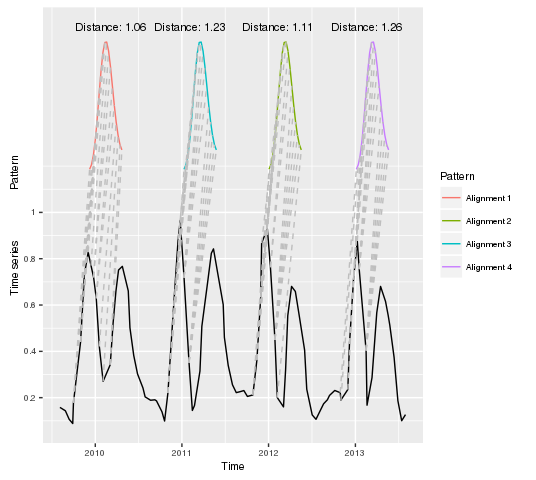
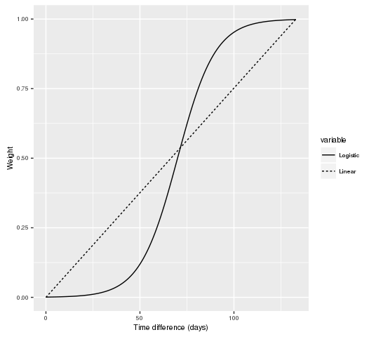
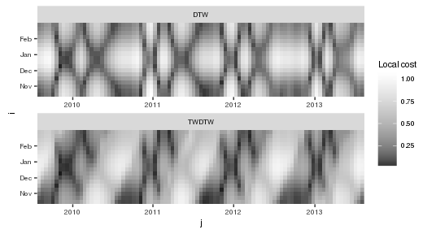
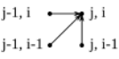
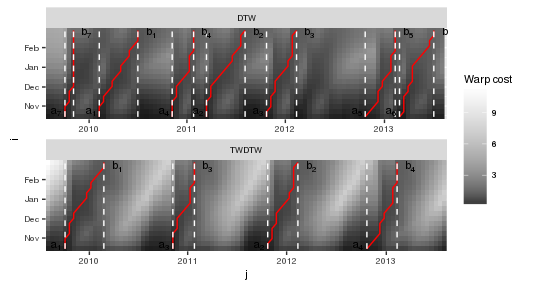

Time-Weighted Dynamic Time Warping is a variation of the classical Dynamic Time Warping (DTW) algorithm that includes a time-weight as constraint to perform a time series alignment. It works by comparing a temporal pattern of a known event observed through a sequence of satellite images (e.g. the phenological cycle of the vegetation) to an unknown long-term satellite time series. This is particularly useful when the temporal pattern is much shorter than the target time series, and to compare time series with strong time dependency, such as phenological the stages of vegetation.

### Introduction

Remote sensors have collected large amount of data bringing unique information about the Earth. This archive of satellite images builds up into time series, which allow studying and better understanding the Earth system. However, inter- and intra-annual variability of some Earth system processes combined with noise and gaps in remotely sensed data have challenged the satellite data analysis (Reed et al. 1994; A.R. Huete et al. 1997, A Huete et al. (2002)). Recently, there has been a great effort to develop new methods capable of dealing with irregularly sampled and out-of-phase remote sensing time series. Methods based on Dynamic Time Warping (DTW), for example, are flexible to handle irregular sampling and out-of-phase time series, and they have achieved significant results in time series data mining (Rabiner and Juang 1993; Berndt and Clifford 1994; Keogh and Ratanamahatana 2005; Müller 2007). Originally, DTW was developed to compare speech records (Velichko and Zagoruyko 1970; Hiroaki Sakoe and Chiba 1971; H. Sakoe and Chiba 1978) but it has shown great potential in other areas, such as, in remote sensing [Petitjean, Inglada, and Gancarski (2012);

The original dynamic time warping method works well for shape matching but it is not suited for remote sensing time series classification. This is because it disregards the temporal range when finding the best alignment between two time series. Each land cover class has a specific phenological cycle, and therefore, a good time-series land cover classifier needs to balance between shape matching and temporal alignment. To that end, Maus et al. (2016) included a temporal weight to the original dynamic time warping method that accounts for seasonality of land cover types.

Here we describe the Time-Weighted Dynamic Time Warping algorithm such as implemented in [dtwSat](https://cran.r-project.org/web/packages/dtwSat/index.html) package. The next sections show the steps of the algorithm highlighting the differences between TWDTW and original Dynamic Time Warping algorithm.

### Notation

Let \(\mathcal{X}\) be a satellite image time series, such that, \(\mathcal{X}=\{\mathbf{x}(t_1), \mathbf{x}(t_2),\, ...,\, \mathbf{x}(t_m)\}\) where \(t\) is the time when a set of measurements \(\mathbf{x}\) where taken, *i.e.* \(\mathbf{x}(t)=\{x_1(t),\, x_2(t),\, ...,\, x_q(t)\}\) and \(q\) is the number of measurements. Let us define a second time series \(\mathcal{Y}=\{\mathbf{y}(t_1), \mathbf{y}(t_2),\, ...,\, \mathbf{y}(t_n)\}\) with the same attributes as \(\mathcal{X}\), however much shorter than that, *i.e* \(n \ll m\). If \(\mathcal{X}\) is an unknown time series and \(\mathcal{Y}\) a well known temporal profile of an event in the earth surface observed through satellite images, we might be interested in the following questions: *i)* How many intervals of \(\mathcal{X}\) are similar to \(\mathcal{Y}\)?, and *ii)* How similar to \(\mathcal{Y}\) these intervals of \(\mathcal{X}\) are? The TWDTW method finds the matching points and computes an associated distance measure for each subinterval of \(\mathcal{X}\) that is similar to \(\mathcal{Y}\), such as illustrated bellow

Matches of the temporal pattens \(\mathcal{Y}\) to the long-term time series \(\mathcal{Y}\).

Note that alignments are independent from each other, therefore we can use the distance measure to rank the them. This is important because we use this distance measure to perform the classification of the subintervals.

In the workflow bellow we show the TWDTW steps that will be better discussed in the following sections.

Workflow to find the alignments between two time series using TWDTW.

### Local cost matrix computation

As showed before the algorithm starts by computing a local cost matrix \(\Psi(\mathcal{X},\mathcal{Y})\) \(n\)-by-\(m\), whose elements are given by \[
    \psi_{j,i} = 
    \phi(\mathbf{x}(t_j),\mathbf{y}(t_i))+
    \omega(t_j,t_i),
    \;j=1,...,m,
    \; \textrm{and}\;i=1,...,n.
    \label{eq:local_cost}
\] Where \(\phi\) is the distance function and \(\omega\) is the time weight function. Most of the DTW approaches define \(\phi\) as an Euclidean distance. The time weight \(\omega\) is what distinguishes TWDTW from DTW, *i.e* if \(\omega=0\) then the equation above returns to the original DTW formulation. The time weight \(\omega\) depends on the time \(t\) when the satellite image was collected. Maus et al. (2016) proposed two functions to compute the temporal weight, a linear with slope \(\theta\) \[
    \omega_{j,i} = \theta g(t_j,t_i),
    \label{eq:lineartw}
\] and a logistic model with midpoint \(\beta\), and steepness \(\alpha\), given by \[
    \omega_{j,i} = \frac{1}{1 + e^{-\alpha(g(t_j,t_i)-\beta)} }.
    \label{eq:nonlineartw}
\] The function \(g\) is the absolute difference in days between the dates \(t_j\) in the time series \(\mathcal{X}\) and \(t_i\) in the time series \(\mathcal{Y}\), *i.e* \(|t_j-t_i|\). These two time-weight functions are illustrated bellow

Illustration of liner time-weight (dashed line) and logistic time-weight (solid line). The linear function implies high cost for small time differences, while the logistic function is more flexible for small time differences.

The time weight is crucial for an accurate identification of temporal patterns bounded to seasons (Maus et al. 2016), such as the phenological cycle of the vegetation observed through remote sensing time series (Zhang et al. 2003). The time weight creates a global constraint reducing the number of low-cost paths in the local cost matrix, consequently, reducing also the chances of temporal inconsistent matching. In the figure bellow we illustrate the difference between the local cost matrices of DTW and Time-Weighted DTW.

Illustration of DTW local cost matrix (top) and Time-Weighted DTW local cost matrix (bottom). The dark areas in the matrices indicate the low-cost candidate paths.

### Accumulated cost matrix computation

The next step of the algorithm is the computation of an accumulated cost matrix \(\mathbf{D}\) based on the local cost matrix \(\Psi\). The accumulated cost matrix \(\mathbf{D}\) results from a recursive sum of minimal distances under a local constraint given by the step type. Here we use a symmetric step given by

\[
      d_{i,j} =  \psi_{i,j} + 
                  min\left\{\begin{array}{l}
                    d_{j  , i-1} \\
                    d_{j-1, i-1} \\
                    d_{j-1, i  }
                  \end{array}\right.
\] and its boundaries conditions \[
  d_{j,i} = \left\{
         \begin{array}{lll}
            \psi_{j,i}              & j=1   ,& i = 1 \\
            \sum_{k=1}^j \psi_{k,i} & i = 1 ,& 1 < j \leq m \\
            \sum_{k=1}^i \psi_{j,k} & j = 1 ,& 1 < i \leq n  
          \end{array}
      \right.
      \label{eq:dtwboundary}
\]

This symmetric step uses only the first order neighbors to compute the recursive sum of minimal distances, *i.e* \(min(d_{j,i-1}, d_{j-1,i-1}, d_{j-1,i})\), as we can see in the following graphical representation 

Using these conditions the algorithm runs a recursive sum of minimal distances using \(\Psi\) as input. The result of this computation is the accumulated cost matrix \(\mathbf{D}\), illustrated bellow.

Illustration of the DTW accumulated cost matrix (top) and the Time-Weighted DTW accumulated cost matrix (bottom). The dark color "valleys" indicate the low-cost paths, *i.e* the candidates to match the temporal pattern to the long-term time series.

Other step types and global constraints have been proposed to compute the accumulated cost matrix (see H. Sakoe and Chiba 1978; Rabiner and Juang 1993; Giorgino 2009; Petitjean, Inglada, and Gancarski 2012). However, we consider the time weighting proposed by (Maus et al. 2015) sufficient constraint for satellite image time series analysis, and therefore the [dtwSat](https://cran.r-project.org/web/packages/dtwSat/index.html) implementation does not address other global constraint algorithms.

### Subintervals and reverse algorithm

The starting point for the reverse algorithm is the last point of each alignment. Therefore, before tracing back the low cost paths we find the minimum points in last line in the accumulated cost matrix, such that \[
  b_k = argmin_k(d_{j,n}),\quad\;j=1,...,m\;\mathrm{and}\;k=1,...,K.\\
      \label{eq:minpoints}
\]

Each candidate in the last line of \(\mathbf{D}\) produces an alignment associated with a TWDTW distance \(\delta_k = d_{b_k,n}\) between \(\mathcal{Y}\) and the \(kth\) interval of \(\mathcal{X}\). The variable \(b_k\) is the index of the last point of the alignment \(k\), and \(K\) is the number of minimum points in last line of the accumulated cost matrix. These step already give us the answer for our motivating questions, *i)* \(K\) is the number of intervals of \(\mathcal{X}\) that are similar to \(\mathcal{Y}\), and *ii)* \(\delta_k\) gives the similarity measure between \(\mathcal{Y}\) and the intervals of \(\mathcal{X}\).

However, we might be interested in find also the matching points between \(\mathcal{Y}\) and the interval of \(\mathcal{X}\). For that we use a reverse algorithm that maps the warping path \(\mathbf{P}_k=(p_1,...,p_L)\) along the \(kth\) low cost ''valley'' in \(\mathbf{D}\). The algorithm starts in \(p_{l=L} = (j=b_k,i=n)\) and ends when \(i=1\), *i.e.* \(p_{l=1} = (j=a_k, i=1)\). Therefore, \(\mathbf{P}_k\) contains the matching points of the alignment between \(\mathcal{Y}\) and the \(kth\) interval of \(\mathcal{X}\), such that \(p_L\) denotes the last pair of coordinates \((j=b_k,i=n)\) and \(p_1\) the first pair of coordinates \((j=a_k, i=1)\). Note that the backward algorithm implies the monotonicity condition (Müller 2007), *i.e.* the alignment preserves the order of the time series. The reverse algorithm in bellow is based on the symmetric step pattern, \[
    p_{l-1} = \left\{
    \begin{array}{ll}
        (a_k=j, i) & if\quad i=1 \\
        (j, i-1) & if\quad j=1 \\
        argmin(d_{j,i-1},d_{j-1,i-1}, d_{j-1,i}) & \textrm{otherwise}
    \end{array}
    \right.
    \label{eq:dtwoptimalwarping}
\]

Bellow we illustrate the results of the reverse algorithm. This example shows the starting and ending points (\(a\) and \(b\)) of four warping paths that are independent from each other. Each path in the accumulated cost matrix has a TWDTW distance \(\delta\) associated that is the value in the last point in the alignment indicated by \(d_{b_k,n}\).

Example of paths in the the accumulated cost matrix \(\mathbf{D}\) after the reverse algorithm. The red lines are the low cost paths, the white lines indicate the start and end of the subintervals of \(\mathcal{X}\), \(a\) and \(b\) are the \(jth\) indices of start and end of the alignments, respectively.

### Conclusions

The TWDTW algorithm is suitable for applications of remote sensing time series where the temporal variation is more important than the spatial variation for classifying remote sensing data sets. The inclusion of a temporal restriction allows for phase-shifts due to seasonal changes of natural and cultivated vegetation types.

### References

Berndt, Donald J., and James Clifford. 1994. “Using Dynamic Time Warping to Find Patterns in Time Series.” In *KDD Workshop*, edited by Usama M. Fayyad and Ramasamy Uthurusamy, 359–70. AAAI Press.

Giorgino, Toni. 2009. “Computing and Visualizing Dynamic Time Warping Alignments in R: The dtw Package.” *Journal of Statistical Software* 31 (7): 1–24. doi:[10.18637/jss.v031.i07](http://dx.doi.org/10.18637/jss.v031.i07).

Huete, A, K Didan, T Miura, E.P Rodriguez, X Gao, and L.G Ferreira. 2002. “Overview of the Radiometric and Biophysical Performance of the MODIS Vegetation Indices.” *Remote Sensing of Environment* 83 (1-2): 195–213. doi:[10.1016/S0034-4257(02)00096-2](http://dx.doi.org/10.1016/S0034-4257(02)00096-2).

Huete, A.R., H.Q. Liu, K. Batchily, and W. van Leeuwen. 1997. “A Comparison of Vegetation Indices over a Global Set of TM Images for EOS-MODIS.” *Remote Sensing of Environment* 59 (3): 440–51. doi:[http://dx.doi.org/10.1016/S0034-4257(96)00112-5](http://dx.doi.org/http://dx.doi.org/10.1016/S0034-4257(96)00112-5).

Keogh, Eamonn, and Chotirat Ann Ratanamahatana. 2005. “Exact Indexing of Dynamic Time Warping.” *Knowledge Information Systems* 7 (3): 358–86.

Maus, Victor, Gilberto Câmara, Ricardo Cartaxo, Fernando M. Ramos, Alber Sanchez, and Gilberto Q. Ribeiro. 2015. “Open Boundary Dynamic Time Warping for Satellite Image Time Series Classification.” In *Geoscience and Remote Sensing Symposium (IGARSS), 2015 IEEE International*, 3349–52. doi:[10.1109/IGARSS.2015.7326536](http://dx.doi.org/10.1109/IGARSS.2015.7326536).

Maus, Victor, Gilberto Câmara, Ricardo Cartaxo, Alber Sanchez, Fernando M. Ramos, and Gilberto R. de Queiroz. 2016. “A Time-Weighted Dynamic Time Warping method for land use and land cover mapping.” *Accepted for Publication in IEEE Journal of Selected Topics in Applied Earth Observations and Remote Sensing* 9 (X): XXXX–XX.

Müller, Meinard. 2007. *Information Retrieval for Music and Motion*. London: Springer.

Petitjean, F., J. Inglada, and P. Gancarski. 2012. “Satellite Image Time Series Analysis Under Time Warping.” *Geoscience and Remote Sensing, IEEE Transactions on* 50 (8): 3081–95. doi:[10.1109/TGRS.2011.2179050](http://dx.doi.org/10.1109/TGRS.2011.2179050).

Rabiner, Lawrence, and Biing-Hwang Juang. 1993. *Fundamentals of Speech Recognition*. Prentice-Hall International, Inc.

Reed, Bradley C., Jesslyn F. Brown, Darrel VanderZee, Thomas R. Loveland, James W. Merchant, and Donald O. Ohlen. 1994. “Measuring Phenological Variability from Satellite Imagery.” *Journal of Vegetation Science* 5 (5): 703–14. doi:[10.2307/3235884](http://dx.doi.org/10.2307/3235884).

Sakoe, H., and S. Chiba. 1978. “Dynamic Programming Algorithm Optimization for Spoken Word Recognition.” *Acoustics, Speech and Signal Processing, IEEE Transactions on* 26 (1): 43–49. doi:[10.1109/TASSP.1978.1163055](http://dx.doi.org/10.1109/TASSP.1978.1163055).

Sakoe, Hiroaki, and Seibi Chiba. 1971. “A Dynamic Programming Approach to Continuous Speech Recognition.” In *Proceedings of the Seventh International Congress on Acoustics, Budapest*, 3:65–69. Budapest: Akadémiai Kiadó.

Velichko, V.M., and N.G. Zagoruyko. 1970. “Automatic Recognition of 200 Words.” *International Journal of Man-Machine Studies* 2 (3): 223–34. doi:[10.1016/S0020-7373(70)80008-6](http://dx.doi.org/10.1016/S0020-7373(70)80008-6).

Zhang, Xiaoyang, Mark A. Friedl, Crystal B. Schaaf, Alan H. Strahler, John C.F. Hodges, Feng Gao, Bradley C. Reed, and Alfredo Huete. 2003. “Monitoring Vegetation Phenology Using MODIS.” *Remote Sensing of Environment* 84 (3): 471–75. doi:[10.1016/S0034-4257(02)00135-9](http://dx.doi.org/10.1016/S0034-4257(02)00135-9).

[1] National Institute for Space Research, Avenida dos Astronautas 1758, 12227010, São José dos Campos, Brazil.

[2] Institute for Geoinformatics, University of Münster, Heisenbergstraße 2, 48149 Münster, Germany
